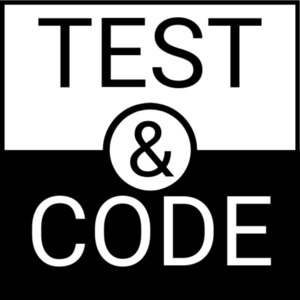
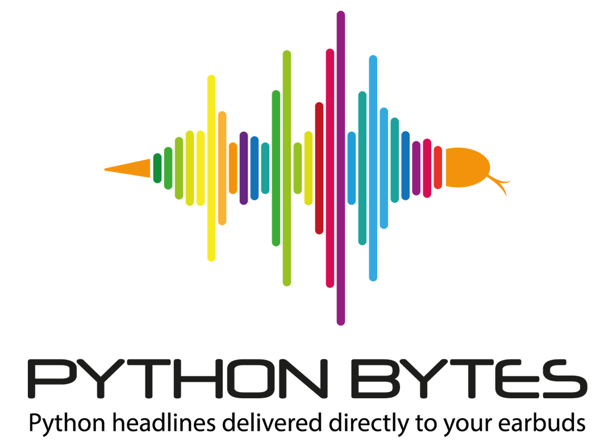
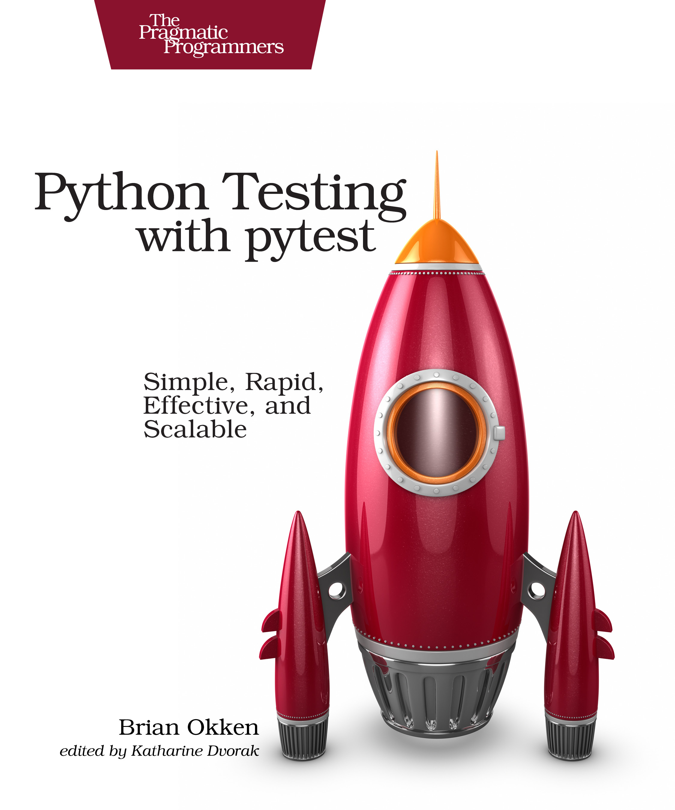

class: center, middle

# Multiply your Testing Effectiveness with Parametrized Testing

Brian Okken

[@brianokken](https://twitter.com/brianokken)

Code and slides 

[github.com/okken/pycascades2020](https://github.com/okken/pycascades2020)

--

pytest & rocket stickers   
come see me after the talk

---

# Brian Okken

.left-column[
Work


Podcasts

<a href="https://testandcode.com">
</a>
<a href="https://pythonbytes.fm">
</a>
]
.right-column[
Book
 
<a href="https://t.co/AKfVKcdDoy?amp=1">

</a>
]

---

# Value of Tests

A passing test suite means:

* I didn't break anything that used to work.
* Future changes won’t break current features.
* The code is ready for users.
* I can refactor until I'm proud of the code.
* Code reviews can focus on team understanding and ownership.

Only works if:

* New features are tested with new tests.
* **Tests are easy and fast to write.**  <- *this is what we're focusing on*

---

# Takeaways

* Why parametrization is useful

* Your choices 
    * function
    * fixture
    * `pytest_generate_tests`
    
* How to 
    * choose a technique
    * run subsets of test cases
    * use `pytest.param` for ids and markers
    * use `indirect` to intercept parameters with fixtures
    
---

# Parametrize vs Parameterize

**parameter** + **ize**

* paramet_erize_ (US)
* paramet_rize_ (UK)

`pytest` uses `parametrize`, the UK spelling.

I've tried to get them to change it.  
They don't want to.  
I've gotten over it. 

---

# Something to Test

`triangles.py`:
```python
def triangle_type(a, b, c):
    """
    Given three angles,
    return 'obtuse', 'acute', 'right', or 'invalid'.
    """
    angles = (a, b, c)
    if 90 in angles:
        return "right"
    if any([a > 90 for a in angles]):
        return "obtuse"
    if all([a < 90 for a in angles]):
        return "acute"
    if sum(angles) != 180:
        return "invalid"
```
Right ,
Acute ,
Obtuse ,

---

# without Parametrization

```python
def test_right():
    assert triangle_type(90, 60, 30) == "right"

def test_obtuse():
    assert triangle_type(100, 40, 40) == "obtuse"

def test_acute():
    assert triangle_type(60, 60, 60) == "acute"

def test_invalid():
    assert triangle_type(0, 0, 0) == "invalid"
```
```
$ pytest test_1.py
=================== test session starts ===================

test_1.py::test_right PASSED                        [ 25%]
test_1.py::test_obtuse PASSED                       [ 50%]
test_1.py::test_acute PASSED                        [ 75%]
test_1.py::test_invalid FAILED                      [100%]

=============== 1 failed, 3 passed in 0.03s ===============
```

---
# pytest.ini

I wanted all the examples to include `--tb=no`, and `-v` for:
* hide tracebacks
* verbose: show the test names

So those are in a `pytest.ini` file:
```
[pytest]
addopts = --tb=no -v
markers =
    smoke : smoke tests
```

---
# Moving to one test (don't do this)
```python
def test_type():
    many_triangles = [
        (90, 60, 30, "right"),
        (100, 40, 40, "obtuse"),
        (60, 60, 60, "acute"),
        (0, 0, 0, "invalid"),
    ]
    for a, b, c, expected in many_triangles:
        assert triangle_type(a, b, c) == expected
```

```shell
$ pytest test_2.py
=================== test session starts ===================

test_2.py::test_type FAILED                         [100%]

==================== 1 failed in 0.03s ====================
```

---
# Function Parametrization
```python
*@pytest.mark.parametrize( 'a, b, c, expected', [
    (90, 60, 30, "right"),
    (100, 40, 40, "obtuse"),
    (60, 60, 60, "acute"),
    (0, 0, 0, "invalid")])
*def test_func(a, b, c, expected):
    assert triangle_type(a, b, c) == expected
```
--
# Function Parametrization
```python
@pytest.mark.parametrize( 'a, b, c, expected', [
    (90, 60, 30, "right"),
    (100, 40, 40, "obtuse"),
    (60, 60, 60, "acute"),
    (0, 0, 0, "invalid")])
def test_func(a, b, c, expected):
    assert triangle_type(a, b, c) == expected
```
```shell 
$ pytest test_3.py
=================== test session starts ===================

test_3.py::test_func[90-60-30-right] PASSED         [ 25%]
test_3.py::test_func[100-40-40-obtuse] PASSED       [ 50%]
test_3.py::test_func[60-60-60-acute] PASSED         [ 75%]
test_3.py::test_func[0-0-0-invalid] FAILED          [100%]

=============== 1 failed, 3 passed in 0.03s ===============
```

---
# Function Parametrization

```python
*many_triangles = [
    (90, 60, 30, "right"),
    (100, 40, 40, "obtuse"),
    (60, 60, 60, "acute"),
    (0, 0, 0, "invalid")
]

*@pytest.mark.parametrize( 'a, b, c, expected', many_triangles)
def test_func(a, b, c, expected):
    assert triangle_type(a, b, c) == expected
```
Test cases moved to a variable

---
# Function Parametrization 

```python
*def many_triangles():
    return [ (90, 60, 30, "right"),
             (100, 40, 40, "obtuse"),
             (60, 60, 60, "acute"),
             (0, 0, 0, "invalid") ]

*@pytest.mark.parametrize( 'a, b, c, expected', many_triangles())
def test_func(a, b, c, expected):
    assert triangle_type(a, b, c) == expected
```
Test cases from a function

---
# Function Parametrization

```python
*def many_triangles():
    for t in [ (90, 60, 30, "right"),
               (100, 40, 40, "obtuse"),
               (60, 60, 60, "acute"),
               (0, 0, 0, "invalid")]:
*        yield t

*@pytest.mark.parametrize( 'a, b, c, expected', many_triangles())
def test_func(a, b, c, expected):
    assert triangle_type(a, b, c) == expected
```
Test cases from a generator

---
# Back to a List
```python
many_triangles = [
    (90, 60, 30, "right"),
    (100, 40, 40, "obtuse"),
    (60, 60, 60, "acute"),
    (0, 0, 0, "invalid")
]

@pytest.mark.parametrize('a, b, c, expected', many_triangles)
def test_func(a, b, c, expected):
    assert triangle_type(a, b, c) == expected

```
```
$ pytest test_7.py 
=================== test session starts ===================

test_7.py::test_func[90-60-30-right] PASSED         [ 25%]
test_7.py::test_func[100-40-40-obtuse] PASSED       [ 50%]
test_7.py::test_func[60-60-60-acute] PASSED         [ 75%]
test_7.py::test_func[0-0-0-invalid] FAILED          [100%]

=============== 1 failed, 3 passed in 0.03s ===============

```

---
# Run the last failing test case
```
*$ pytest --tb=short --lf test_7.py 
=================== test session starts ===================
collected 4 items / 3 deselected / 1 selected             
run-last-failure: rerun previous 1 failure

test_7.py::test_func[0-0-0-invalid] FAILED          [100%]

======================== FAILURES =========================
________________ test_func[0-0-0-invalid] _________________
test_7.py:14: in test_func
    assert triangle_type(a, b, c) == expected
E   AssertionError: assert 'acute' == 'invalid'
E     - acute
E     + invalid
============= 1 failed, 3 deselected in 0.03s =============
```

---
# Run test cases with 60 degree angles 
```
*$ pytest -k 60 test_7.py 
=================== test session starts ===================

test_7.py::test_func[90-60-30-right] PASSED         [ 50%]
test_7.py::test_func[60-60-60-acute] PASSED         [100%]

============= 2 passed, 2 deselected in 0.01s =============
```

---
# Run an individual test case 
```
*$ pytest test_7.py::test_func[0-0-0-invalid]
=================== test session starts ===================

test_7.py::test_func[0-0-0-invalid] FAILED          [100%]

==================== 1 failed in 0.03s ====================
```

---
# Fixture Parametrization

Function: `test_7.py`
```python
@pytest.mark.parametrize('a, b, c, expected', many_triangles)
def test_func(a, b, c, expected):
    assert triangle_type(a, b, c) == expected

```

Fixture `test_8.py:` 
```python
*@pytest.fixture(params=many_triangles)
*def a_triangle(request):
*    return request.param

*def test_fix(a_triangle):
*    a, b, c, expected = a_triangle
    assert triangle_type(a, b, c) == expected
```


---
# Fixture Parametrization
```python
many_triangles = [
*    (90, 60, 30, "right"),
*    (100, 40, 40, "obtuse"),
*    (60, 60, 60, "acute"),
*    (0, 0, 0, "invalid")]

@pytest.fixture(params=many_triangles)
def a_triangle(request):
    return request.param

def test_fix(a_triangle):
    a, b, c, expected = a_triangle
    assert triangle_type(a, b, c) == expected
```
```
$ pytest test_8.py 
=================== test session starts ===================
*test_8.py::test_fix[a_triangle0] PASSED             [ 25%]
*test_8.py::test_fix[a_triangle1] PASSED             [ 50%]
*test_8.py::test_fix[a_triangle2] PASSED             [ 75%]
*test_8.py::test_fix[a_triangle3] FAILED             [100%]

=============== 1 failed, 3 passed in 0.03s ===============

```


---
# Fixture Parametrization 
```python
many_triangles = [
*    (90, 60, 30, "right"),
*    (100, 40, 40, "obtuse"),
*    (60, 60, 60, "acute"),
*    (0, 0, 0, "invalid") ]

@pytest.fixture(params=many_triangles,
*                ids=['right', 'obtuse', 'acute', 'invalid'])
def a_triangle(request):
    return request.param

def test_fix(a_triangle):
    a, b, c, expected = a_triangle
    assert triangle_type(a, b, c) == expected
```

```
$ pytest test_9.py 
=================== test session starts ===================
*test_9.py::test_fix[right] PASSED                   [ 25%]
*test_9.py::test_fix[obtuse] PASSED                  [ 50%]
*test_9.py::test_fix[acute] PASSED                   [ 75%]
*test_9.py::test_fix[invalid] FAILED                 [100%]
=============== 1 failed, 3 passed in 0.03s ===============
```


---
# Fixture Parametrization
```python
many_triangles = [
     (90, 60, 30, "right"),
     (100, 40, 40, "obtuse"),
     (60, 60, 60, "acute"),
     (0, 0, 0, "invalid") ]

@pytest.fixture(params=many_triangles, 
*                ids=str)  # or repr
def a_triangle(request):
    return request.param

def test_fix(a_triangle):
    a, b, c, expected = a_triangle
    assert triangle_type(a, b, c) == expected

```
```
$ pytest test_10.py 
=================== test session starts ===================
*test_10.py::test_fix[(90, 60, 30, 'right')] PASSED  [ 25%]
*test_10.py::test_fix[(100, 40, 40, 'obtuse')] PASSED [ 50%]
*test_10.py::test_fix[(60, 60, 60, 'acute')] PASSED  [ 75%]
*test_10.py::test_fix[(0, 0, 0, 'invalid')] FAILED   [100%]
=============== 1 failed, 3 passed in 0.03s ===============

```


---
# Fixture Parametrization 
```python
*def idfn(a_triangle):
*    a, b, c, expected = a_triangle
*    return f'{a}-{b}-{c}-{expected}'

*@pytest.fixture(params=many_triangles, ids=idfn)
def a_triangle(request):
    return request.param

def test_fix(a_triangle):
    a, b, c, expected = a_triangle
    assert triangle_type(a, b, c) == expected
```

```
$ pytest test_11.py 
=================== test session starts ===================
*test_11.py::test_fix[90-60-30-right] PASSED         [ 25%]
*test_11.py::test_fix[100-40-40-obtuse] PASSED       [ 50%]
*test_11.py::test_fix[60-60-60-acute] PASSED         [ 75%]
*test_11.py::test_fix[0-0-0-invalid] FAILED          [100%]
=============== 1 failed, 3 passed in 0.03s ===============
```


---
# pytest_generate_tests()
```python
*def pytest_generate_tests(metafunc):
*    if "gen_triangle" in metafunc.fixturenames:
*        metafunc.parametrize("gen_triangle",
*                             many_triangles,
*                             ids=idfn)

def test_gen(gen_triangle):
    a, b, c, expected = gen_triangle
    assert triangle_type(a, b, c) == expected
```

```
$ pytest test_12.py 
=================== test session starts ===================

test_12.py::test_gen[90-60-30-right] PASSED         [ 25%]
test_12.py::test_gen[100-40-40-obtuse] PASSED       [ 50%]
test_12.py::test_gen[60-60-60-acute] PASSED         [ 75%]
test_12.py::test_gen[0-0-0-invalid] FAILED          [100%]

=============== 1 failed, 3 passed in 0.03s ===============
```

---
# metafunc

From [docs.pytest.org/en/latest/reference.html#metafunc](https://docs.pytest.org/en/latest/reference.html#metafunc)

* Metafunc objects are passed to the pytest_generate_tests hook.  
* They help to inspect a test function and to generate tests according to 
    * test configuration 
    * or values specified in the class or module where a test function is defined.


---
# test.param
`test_12.py:`
```python
many_triangles = [
     (90, 60, 30, "right"),
     (100, 40, 40, "obtuse"),
     (60, 60, 60, "acute"),
     (0, 0, 0, "invalid") 
]
```
`test_13.py:`
```python
*smoke = pytest.mark.smoke

many_triangles = [
*    pytest.param(90, 60, 30, "right", marks=smoke),
*    pytest.param(100, 40, 40, "obtuse", marks=smoke),
    (90, 60, 30, "right"),
*    pytest.param(0, 0, 0, "invalid", id='zeros'),
]
```

---
# test.param

```python
smoke = pytest.mark.smoke

many_triangles = [
    pytest.param(90, 60, 30, "right", marks=smoke),
    pytest.param(100, 40, 40, "obtuse", marks=smoke),
    (90, 60, 30, "right"),
    pytest.param(0, 0, 0, "invalid", id='zeros'),
]
```
```
*$ pytest -m smoke test_13.py 
=================== test session starts ===================
test_13.py::test_func[90-60-30-right] PASSED        [ 50%]
test_13.py::test_func[100-40-40-obtuse] PASSED      [100%]
============= 2 passed, 4 deselected in 0.01s =============
```
```
*$ pytest -k zeros test_13.py 
=================== test session starts ===================
test_13.py::test_func[zeros] PASSED                 [100%]
============= 1 passed, 3 deselected in 0.01s =============
```
---
# indirect parameter
`test_14.py:`
```python
@pytest.fixture()
*def expected(request):
    if request.param == 'obtuse':
        print('\nthis is one of the obtuse cases')
    return request.param


@pytest.mark.parametrize('a, b, c, expected', many_triangles,
*                         indirect=['expected'])
def test_func(a, b, c, expected):
    assert triangle_type(a, b, c) == expected
```

The parameter value goes through a fixture before making
it to the test, an "indirect" route.


---

# More test cass

```python
many_triangles = [
    (  1, 1, 178, "obtuse"), # big angles
    ( 91, 44, 45, "obtuse"), # just over 90
    (0.01, 0.01, 179.98, "obtuse"), # decimals 

    (90, 60, 30, "right"), # check 90 for each angle
    (10, 90, 80, "right"),
    (85,  5, 90, "right"),

    (89, 89,  2, "acute"), # just under 90
    (60, 60, 60, "acute"),

    (0, 0, 0, "invalid"),     # zeros
    (61, 60, 60, "invalid"),  # sum > 180
    (90, 91, -1, "invalid"),  # negative numbers
]
``` 

For more on test case selection:
* [Test & Code 38](https://testandcode.com/38) : Prioritize software tests with RCRCRC
* [Test & Code 39](https://testandcode.com/39) : equivalence partitioning, boundary value analysis, decision tables

---
# Review

```python
@pytest.mark.parametrize('a, b, c, expected', many_triangles)
def test_func(a, b, c, expected):
    assert triangle_type(a, b, c) == expected
```
```python
@pytest.fixture(params=many_triangles, ids=idfn)
def a_triangle(request):
    return request.param

def test_fix(a_triangle):
    a, b, c, expected = a_triangle
    assert triangle_type(a, b, c) == expected
```
```python
def pytest_generate_tests(metafunc):
    if "gen_triangle" in metafunc.fixturenames:
        metafunc.parametrize("gen_triangle",
                             many_triangles, ids=idfn)

def test_gen(gen_triangle):
    a, b, c, expected = gen_triangle
    assert triangle_type(a, b, c) == expected
```

---
# Choosing a Technique

Guidelines

1. **function parametrization**
    * use this if you can
2. **fixture parametrization**
    * if doing work to set up each fixture value
    * if running multiple test against the same set of "setup states"
3. **pytest_generate_tests()**
    * if list is based on passed in parameters or external resources
      or other introspection not available to other methods


---
# Combining Techniques

You can have multiple parametrizations for a test function.

* can have multiple `@pytest.mark.parametrize()` decorators on a test function.
* can parameterize multipe fixtures per test
* can use pytest_generate_tests() to parametrize multiple parameters
* can use a combination of techniques 
* can blow up into lots and lots of test cases very fast
---

# Resources

.left-two-thirds[
* [Python Testing with pytest](https://t.co/AKfVKcdDoy?amp=1) 
    * The fastest way to get super productive with pytest
* pytest docs on 
    * [parametrization, in general](https://docs.pytest.org/en/latest/parametrize.html) 
    * [function parametrization](https://docs.pytest.org/en/latest/parametrize.html#pytest-mark-parametrize)
    * [fixture parametrization](https://docs.pytest.org/en/latest/fixture.html#fixture-parametrize)
    * [pytest_generate_tests](https://docs.pytest.org/en/latest/parametrize.html#basic-pytest-generate-tests-example)
    * [indirect](http://doc.pytest.org/en/latest/example/parametrize.html#apply-indirect-on-particular-arguments)
* podcasts
    * [Test & Code](https://testandcode.com) 
    * [Python Bytes](https://pythonbytes.fm)
    * [Talk Python](https://talkpython.fm)
* slack community: [Test & Code Slack](https://testandcode.com/slack) 
* Twitter: [@brianokken](https://twitter.com/brianokken), [@testandcode](https://twitter.com/testandcode)
* This code, and markdown for slides, on [github.com/okken/pycascades2020](https://github.com/okken/pycascades2020)
]
.right-third[
<a href="https://t.co/AKfVKcdDoy?amp=1">

</a>
]
