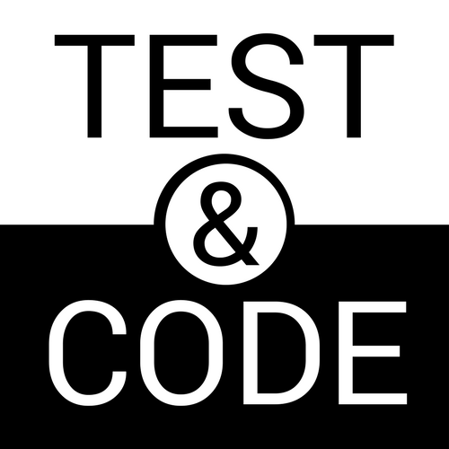
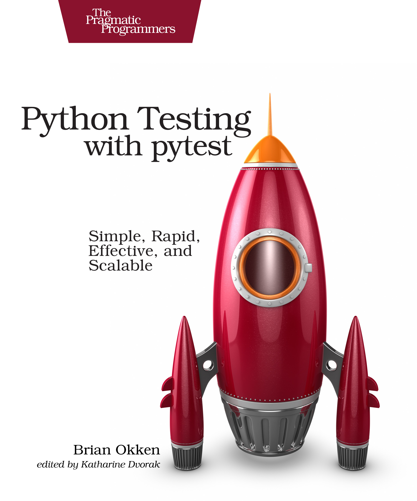
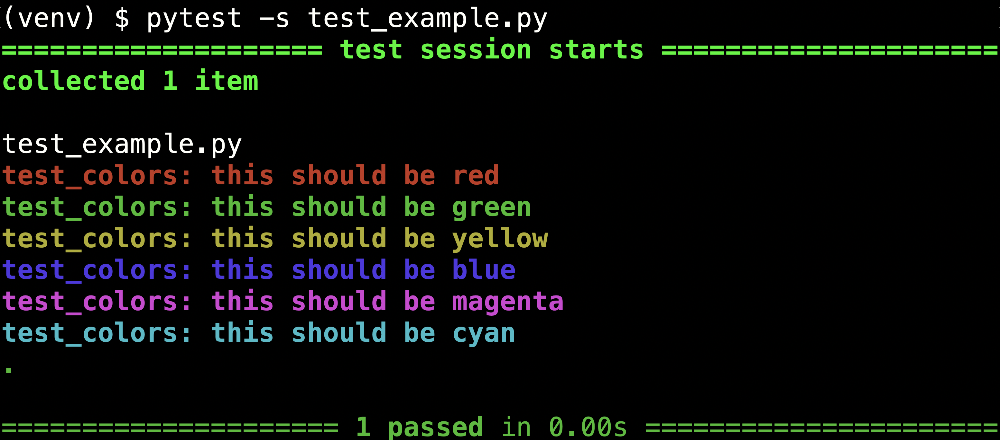
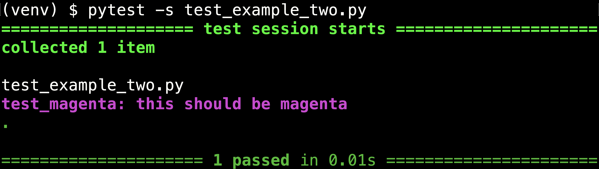
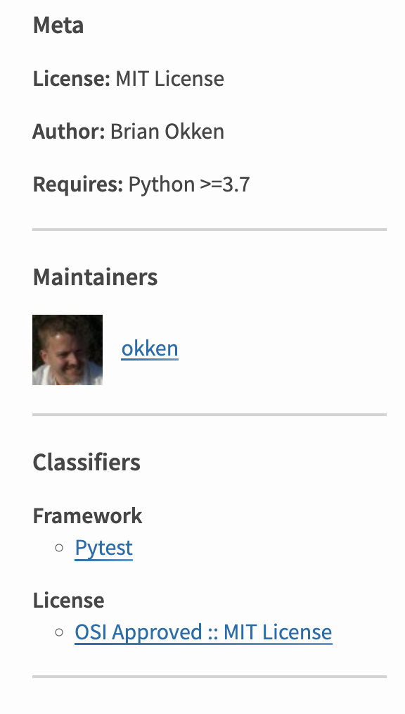
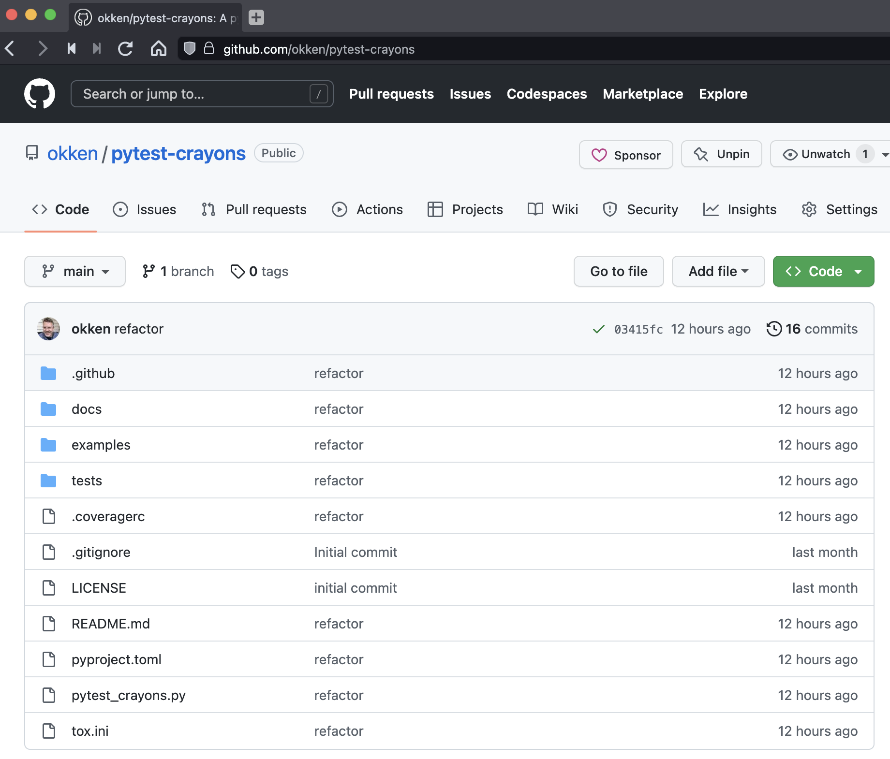
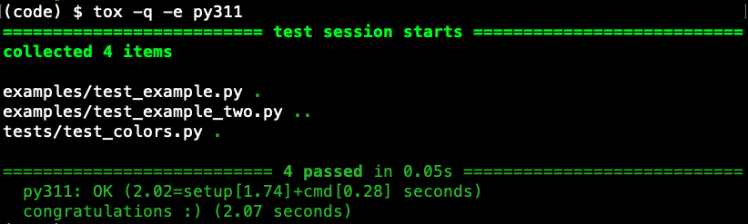
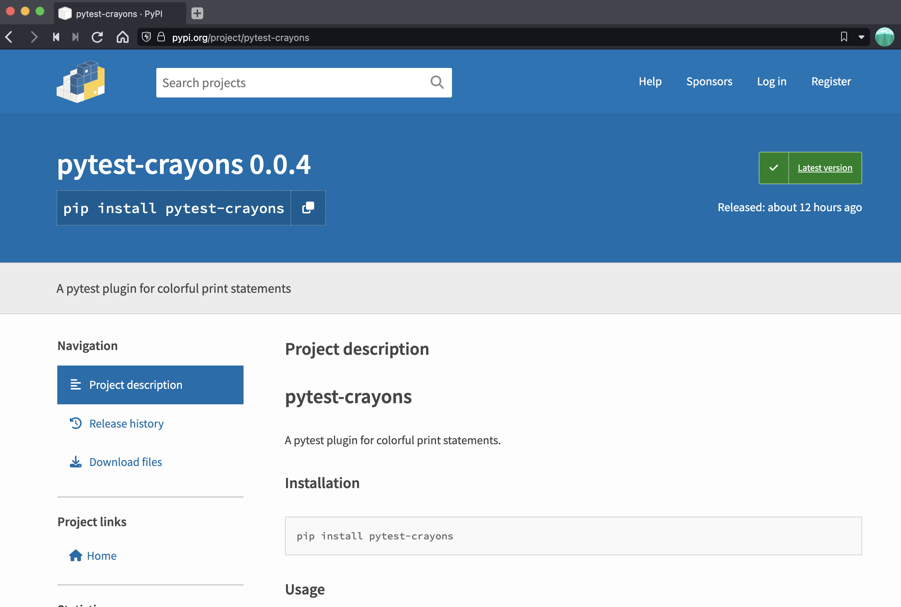
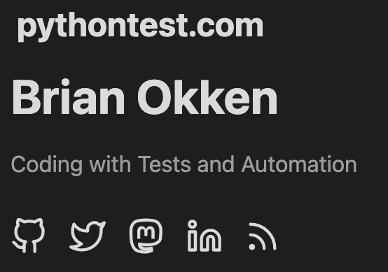

build-lists: true
footer: Brian Okken | pythontest.com/pycascades-2023 

# Sharing is Caring
## sharing pytest fixtures

[.text: alignment(center)]

#### _
### Brian Okken

[.hide-footer]

---

# Slides + Code 

[.text: alignment(center)]
## pythontest.com/pycascades-2023
[.hide-footer]

---

# Brian Okken 
[.build-lists: false]

[.column]
* Podcasts
  Python Bytes / Test & Code

[.column]
 
 

---

# Brian Okken 
[.build-lists: false]

[.column]
* Podcasts
  Python Bytes / Test & Code
* Books
  Python Testing with pytest

[.column]
  
 

---

# Brian Okken 
[.build-lists: false]

[.column]
* Podcasts
  Python Bytes / Test & Code
* Books
  Python Testing with pytest
* Training
  pythontest.com/courses
  pythontest.com/training

[.column]
  
 

---

# Brian Okken 
[.build-lists: false]

[.column]
* Podcasts
  Python Bytes / Test & Code
* Books
  Python Testing with pytest
* Training
  pythontest.com/courses
  pythontest.com/training
* Lead Software Engineer

[.column]
  
  
  

---
# System level testing
[.build-lists: false]
### Is what led me to pytest

  
 

---

# Why?

---


# multi-level pytest fixtures
[.build-lists: false]
[.column]
* Setup: connect, reset, configure, ...
* Teardown: reset switches, check logs, ...
* Multiple Levels: session, module, function, ...

[.column]
 
 
 


---
# pytest fixtures are awesome
---
# pytest is awesome
---
# you are awesome
---
# you're here, right?
---
# you will make 
# fixtures so awesome 
# you want to share them

---

# Fixture crash course

---
# typical example

[.column]
```python
import pytest 

@pytest.fixture()
def db():
    ... # connect to db
    yield _db 
    ... # disconnect
```

---
# typical example

[.column]
```python
import pytest 

@pytest.fixture()
def db():
    ... # connect to db
    yield _db 
    ... # disconnect
```

[.column]
```python
def test_foo(db):
    ...
    result = db.action()
    ...

def test_bar(db):
    ...
    result = db.action()
    ...
```
---

# but frankly

---

# that's too useful for this talk

---

# How about 

---

# colorful print statements



---

# let's start with just one

 

---

# Using the fixture

```python
def test_magenta(magenta):
    print("")  
    magenta("this should be magenta")
```


---

# The fixture

[.code-highlight: 1,11-13]
[.code-highlight: 1-2,11-13]
[.code-highlight: 1-4,11-13]
[.code-highlight: 1-5,11-13]
[.code-highlight: 1-6,11-13]
[.code-highlight: all]

```python
import pytest
from functools import partial

MAGENTA = "\x1b[35m"
RESET = "\x1b[0m"
BOLD = "\x1b[1m"

def _color_print(color: str, func_name: str, text: str):
    print(f"{BOLD}{color}{func_name}: {text}{RESET}")

@pytest.fixture()
def magenta(request):
    return partial(_color_print, MAGENTA, request.node.name)
```


---
# More colors

```python
@pytest.fixture()
def red(request):
    return partial(_color_print, RED, request.node.name)

@pytest.fixture()
def green(request):
    return partial(_color_print, GREEN, request.node.name)

@pytest.fixture()
def yellow(request):
    return partial(_color_print, YELLOW, request.node.name)

@pytest.fixture()
def blue(request):
    return partial(_color_print, BLUE, request.node.name)

@pytest.fixture()
def magenta(request):
    return partial(_color_print, MAGENTA, request.node.name)

@pytest.fixture()
def cyan(request):
    return partial(_color_print, CYAN, request.node.name)
```

---

# We can use them all!

```python
def test_colors(red, green, yellow, blue, magenta, cyan):
    print("")  
    red("this should be red")
    green("this should be green")
    yellow("this should be yellow")
    blue("this should be blue")
    magenta("this should be magenta")
    cyan("this should be cyan")
```

---

# Several colors are nice


--- 

# That was fun

---

# But they can't be shared 

---

# Yet

---
# They're in the test file

[.column]

```python
import pytest
from functools import partial

# Terminal color codes
RED = "\x1b[31m"
GREEN = "\x1b[32m"
YELLOW = "\x1b[33m"
BLUE = "\x1b[34m"
MAGENTA = "\x1b[35m"
CYAN = "\x1b[36m"
RESET = "\x1b[0m"
BOLD = "\x1b[1m"

def _color_print(color: str, func_name: str, text: str):
    print(f"{BOLD}{color}{func_name}: {text}{RESET}")

@pytest.fixture()
def red(request):
    return partial(_color_print, RED, request.node.name)

@pytest.fixture()
def green(request):
    return partial(_color_print, GREEN, request.node.name)
```

[.column]

```python
@pytest.fixture()
def yellow(request):
    return partial(_color_print, YELLOW, request.node.name)

@pytest.fixture()
def blue(request):
    return partial(_color_print, BLUE, request.node.name)

@pytest.fixture()
def magenta(request):
    return partial(_color_print, MAGENTA, request.node.name)

@pytest.fixture()
def cyan(request):
    return partial(_color_print, CYAN, request.node.name)

def test_colors(red, green, yellow, blue, magenta, cyan):
    print("")  
    red("this should be red")
    green("this should be green")
    yellow("this should be yellow")
    blue("this should be blue")
    magenta("this should be magenta")
    cyan("this should be cyan")

def test_magenta(magenta):
    print("")  
    magenta("this should be magenta")

```
---

# We need to set them free

----

# And put them in a conftest.py file

[.code-highlight: all]
[.code-highlight: 2]
```
test_directory
├── conftest.py 
├── test_example.py 
└── test_example_two.py
```

---

# conftest.py

[.column]
```python
import pytest
from functools import partial

# Terminal color codes
RED = "\x1b[31m"
GREEN = "\x1b[32m"
YELLOW = "\x1b[33m"
BLUE = "\x1b[34m"
MAGENTA = "\x1b[35m"
CYAN = "\x1b[36m"
RESET = "\x1b[0m"
BOLD = "\x1b[1m"

def _color_print(color: str, func_name: str, text: str):
    print(f"{BOLD}{color}{func_name}: {text}{RESET}")

@pytest.fixture()
def red(request):
    return partial(_color_print, RED, request.node.name)


@pytest.fixture()
def green(request):
    return partial(_color_print, GREEN, request.node.name)

```

[.column]
```python

@pytest.fixture()
def yellow(request):
    return partial(_color_print, YELLOW, request.node.name)


@pytest.fixture()
def blue(request):
    return partial(_color_print, BLUE, request.node.name)


@pytest.fixture()
def magenta(request):
    return partial(_color_print, MAGENTA, request.node.name)


@pytest.fixture()
def cyan(request):
    return partial(_color_print, CYAN, request.node.name)

```


----
# test_example.py
```python
def test_colors(red, green, yellow, blue, magenta, cyan):
    print("") 
    red("this should be red")
    green("this should be green")
    yellow("this should be yellow")
    blue("this should be blue")
    magenta("this should be magenta")
    cyan("this should be cyan")
```

---

# test\_example\_two.py

```python
def test_magenta(magenta):
    print("")  
    magenta("this should be magenta")
```

----

# Now sharing works
## In the same directory

```
test_directory
├── conftest.py 
├── test_example.py 
└── test_example_two.py
```

----

# How about different directories?

---

# For tests in subdirectories
## It's still fine
```
test_directory
├── conftest.py 
├── one
│   └── test_example.py
└── two
    └── test_example_two.py
```


---

# Multiple conftest.py files
## Still fine

[.code-highlight: all]
[.code-highlight: 2,4,7]

```
test_directory
├── conftest.py 
├── one
|   ├── conftest.py
│   └── test_example.py
└── two
    ├── conftest.py
    └── test_example_two.py
```

---

# How about sharing between projects?

---

# This is where it gets fun

---

# We're going to start here

[.column]
```
test_directory
├── conftest.py 
├── test_example.py 
└── test_example_two.py
```

--- 

# And move to

[.column]
```
test_directory
├── conftest.py 
├── test_example.py 
└── test_example_two.py
```
[.column]

```
pytest-crayons
├── LICENSE
├── README.md
├── examples
│   ├── test_example.py
│   └── test_example_two.py
├── pyproject.toml
├── pytest_crayons.py
├── tests
│   ├── conftest.py
│   └── test_colors.py
└── tox.ini
```

---

# Yes. We're going to talk about ...

---

# Packaging

---

# and 
# building a 
# pytest plugin
---

# packaging pytest plugins

---

# Trust me
## it's not that bad

---

# So how do we get from here to there?

[.column]
```
test_directory
├── conftest.py 
├── test_example.py 
└── test_example_two.py
```
[.column]

```
pytest-crayons
├── LICENSE
├── README.md
├── examples
│   ├── test_example.py
│   └── test_example_two.py
├── pyproject.toml
├── pytest_crayons.py
├── tests
│   ├── conftest.py
│   └── test_colors.py
└── tox.ini
```
---
# test_directory -> pytest-crayons

[.column]
[.code-highlight: 1]
```
test_directory
├── conftest.py 
├── test_example.py 
└── test_example_two.py
```
[.column]
[.code-highlight: 1]
```
pytest-crayons
├── LICENSE
├── README.md
├── examples
│   ├── test_example.py
│   └── test_example_two.py
├── pyproject.toml
├── pytest_crayons.py
├── tests
│   ├── conftest.py
│   └── test_colors.py
└── tox.ini
```
---

# Fixtures: conftest.py -> pytest_crayons.py

[.column]
[.code-highlight: 2]
```
test_directory
├── conftest.py 
├── test_example.py 
└── test_example_two.py
```
[.column]
[.code-highlight: 8]
```
pytest-crayons
├── LICENSE
├── README.md
├── examples
│   ├── test_example.py
│   └── test_example_two.py
├── pyproject.toml
├── pytest_crayons.py
├── tests
│   ├── conftest.py
│   └── test_colors.py
└── tox.ini
```

---

# src is also an option

[.column]
[.code-highlight: 2]
```
test_directory
├── conftest.py 
├── test_example.py 
└── test_example_two.py
```
[.column]
[.code-highlight: 8,9]
```
pytest-crayons
├── LICENSE
├── README.md
├── examples
│   ├── test_example.py
│   └── test_example_two.py
├── pyproject.toml
├── src
│   └── pytest_colors.py
├── tests
│   ├── conftest.py
│   └── test_colors.py
└── tox.ini
```
---

# or you can get fancy

[.column]
[.code-highlight: 2]
```
test_directory
├── conftest.py 
├── test_example.py 
└── test_example_two.py
```
[.column]
[.code-highlight: 8-11]
```
pytest-crayons
├── LICENSE
├── README.md
├── examples
│   ├── test_example.py
│   └── test_example_two.py
├── pyproject.toml
├── src
│   └── pytest_colors
│       ├── __init__.py
│       └── plugin.py
├── tests
│   ├── conftest.py
│   └── test_colors.py
└── tox.ini
```

---

# But let's stick with pytest_crayons.py

[.column]
[.code-highlight: 2]
```
test_directory
├── conftest.py 
├── test_example.py 
└── test_example_two.py
```
[.column]
[.code-highlight: 8]
```
pytest-crayons
├── LICENSE
├── README.md
├── examples
│   ├── test_example.py
│   └── test_example_two.py
├── pyproject.toml
├── pytest_crayons.py
├── tests
│   ├── conftest.py
│   └── test_colors.py
└── tox.ini
```

---
# examples -> examples

[.column]
[.code-highlight: 3,4]
```
test_directory
├── conftest.py 
├── test_example.py 
└── test_example_two.py
```

[.column]
[.code-highlight: 4,5,6]
```
pytest-crayons
├── LICENSE
├── README.md
├── examples
│   ├── test_example.py
│   └── test_example_two.py
├── pyproject.toml
├── pytest_crayons.py
├── tests
│   ├── conftest.py
│   └── test_colors.py
└── tox.ini
```
---

# existing stuff

[.column]
[.code-highlight: 1-4]
```
test_directory
├── conftest.py 
├── test_example.py 
└── test_example_two.py
```

[.column]
[.code-highlight: 1,4-6, 8]
```
pytest-crayons
├── LICENSE
├── README.md
├── examples
│   ├── test_example.py
│   └── test_example_two.py
├── pyproject.toml
├── pytest_crayons.py
├── tests
│   ├── conftest.py
│   └── test_colors.py
└── tox.ini
```
---

# New stuff
[.column]
[.code-highlight: 0]
```
test_directory
├── conftest.py 
├── test_example.py 
└── test_example_two.py
```

[.column]
[.code-highlight: 2,3,7,9-11,12]
```
pytest-crayons
├── LICENSE
├── README.md
├── examples
│   ├── test_example.py
│   └── test_example_two.py
├── pyproject.toml
├── pytest_crayons.py
├── tests
│   ├── conftest.py
│   └── test_colors.py
└── tox.ini
```

---

# LICENSE


[.column]
[.code-highlight: 2]
```
pytest-crayons
├── LICENSE
├── README.md
├── examples
│   ├── test_example.py
│   └── test_example_two.py
├── pyproject.toml
├── pytest_crayons.py
├── tests
│   ├── conftest.py
│   └── test_colors.py
└── tox.ini
```

[.column]

```
The MIT License (MIT)

Copyright (c) 2023, Brian Okken

Permission is hereby granted, ...
...
```

---

# README.md
[.build-lists: false ]

[.column]
[.code-highlight: 3]
```
pytest-crayons
├── LICENSE
├── README.md
├── examples
│   ├── test_example.py
│   └── test_example_two.py
├── pyproject.toml
├── pytest_crayons.py
├── tests
│   ├── conftest.py
│   └── test_colors.py
└── tox.ini
```

[.column]
```
# pytest-crayons

... < what it does >
... < why you should use it >

## Installation

... < how to install it >

## Usage

... < code sample >
... < how to use it >

```

---

# pyproject.toml

[.code-highlight: 7]
```
pytest-crayons
├── LICENSE
├── README.md
├── examples
│   ├── test_example.py
│   └── test_example_two.py
├── pyproject.toml
├── pytest_crayons.py
├── tests
│   ├── conftest.py
│   └── test_colors.py
└── tox.ini
```
---

# Let's come back to that

---

# more tests and tox

[.code-highlight: 9-12]
```
pytest-crayons
├── LICENSE
├── README.md
├── examples
│   ├── test_example.py
│   └── test_example_two.py
├── pyproject.toml
├── pytest_crayons.py
├── tests
│   ├── conftest.py
│   └── test_colors.py
└── tox.ini
```
---

# pyproject.toml

[.code-highlight: 7]
```
pytest-crayons
├── LICENSE
├── README.md
├── examples
│   ├── test_example.py
│   └── test_example_two.py
├── pyproject.toml
├── pytest_crayons.py
├── tests
│   ├── conftest.py
│   └── test_colors.py
└── tox.ini
```
---

# Now might be 
# a good time for a 
# deep breath

---

[.code-highlight: all]

# pyproject.toml 

```toml
[project]
name = "pytest-crayons"
description = "A pytest plugin for colorful print statements"
version = "0.0.4"
authors = [{name = "Brian Okken"}]
requires-python = ">=3.7"
readme = "README.md"
license = {file = "LICENSE"}
dependencies = ["pytest"]
classifiers = [
    "License :: OSI Approved :: MIT License",
    "Framework :: Pytest"
    ]

[project.urls]
Home = "https://github.com/okken/pytest-crayons"

[project.entry-points.pytest11]
pytest_crayons = "pytest_crayons"

[build-system]
requires = ["flit_core >=3.2,<4"]
build-backend = "flit_core.buildapi"

[tool.flit.module]
name = "pytest_crayons"
```

---

[.code-highlight: 1-13]

# Project

```toml
[project]
name = "pytest-crayons"
description = "A pytest plugin for colorful print statements"
version = "0.0.4"
authors = [{name = "Brian Okken"}]
requires-python = ">=3.7"
readme = "README.md"
license = {file = "LICENSE"}
dependencies = ["pytest"]
classifiers = [
    "License :: OSI Approved :: MIT License",
    "Framework :: Pytest"
    ]

[project.urls]
Home = "https://github.com/okken/pytest-crayons"

[project.entry-points.pytest11]
pytest_crayons = "pytest_crayons"

[build-system]
requires = ["flit_core >=3.2,<4"]
build-backend = "flit_core.buildapi"

[tool.flit.module]
name = "pytest_crayons"
```
---
[.build-lists: false]

# Project 
[.code-highlight: all]
[.code-highlight: 2]
[.code-highlight: 3]
[.code-highlight: 4]
[.code-highlight: 5]
[.code-highlight: 6]
[.code-highlight: 7]
[.code-highlight: 8]
[.code-highlight: 9]
[.code-highlight: 10-13]


```toml
[project]
name = "pytest-crayons"
description = "A pytest plugin for colorful print statements"
version = "0.0.4"
authors = [{name = "Brian Okken"}]
requires-python = ">=3.7"
readme = "README.md"
license = {file = "LICENSE"}
dependencies = ["pytest"]
classifiers = [
    "License :: OSI Approved :: MIT License",
    "Framework :: Pytest"
    ]
```

----
# Classifiers
[.build-lists: false]

```toml
classifiers = [
    "License :: OSI Approved :: MIT License",
    "Framework :: Pytest"
    ]
```

* These need to be exact matches
* Look them up at pypi.org/classifiers/

----

[.column]
 

[.column]
Shows up on left sidebar of PyPI


----
[.code-highlight: 15-16]

# URL

```toml
[project]
name = "pytest-crayons"
description = "A pytest plugin for colorful print statements"
version = "0.0.4"
authors = [{name = "Brian Okken"}]
requires-python = ">=3.7"
readme = "README.md"
license = {file = "LICENSE"}
dependencies = ["pytest"]
classifiers = [
    "License :: OSI Approved :: MIT License",
    "Framework :: Pytest"
    ]

[project.urls]
Home = "https://github.com/okken/pytest-crayons"

[project.entry-points.pytest11]
pytest_crayons = "pytest_crayons"

[build-system]
requires = ["flit_core >=3.2,<4"]
build-backend = "flit_core.buildapi"

[tool.flit.module]
name = "pytest_crayons"
```
---

# URL

```toml
[project.urls]
Home = "https://github.com/okken/pytest-crayons"
```

----

[.code-highlight: 18-19]

# pytest entry point

```toml
[project]
name = "pytest-crayons"
description = "A pytest plugin for colorful print statements"
version = "0.0.4"
authors = [{name = "Brian Okken"}]
requires-python = ">=3.7"
readme = "README.md"
license = {file = "LICENSE"}
dependencies = ["pytest"]
classifiers = [
    "License :: OSI Approved :: MIT License",
    "Framework :: Pytest"
    ]

[project.urls]
Home = "https://github.com/okken/pytest-crayons"

[project.entry-points.pytest11]
pytest_crayons = "pytest_crayons"

[build-system]
requires = ["flit_core >=3.2,<4"]
build-backend = "flit_core.buildapi"

[tool.flit.module]
name = "pytest_crayons"
```
---

# pytest entry point

```toml
[project.entry-points.pytest11]
pytest_crayons = "pytest_crayons"
```

---
# pytest entry point
```toml
[project.entry-points.pytest11]
pytest_crayons = "pytest_crayons"
```

Supposedly it's:

```toml
plugin_name = "module"
```

---
[.build-lists: false]
# pytest entry point
```toml
[project.entry-points.pytest11]
pytest_crayons = "pytest_crayons"
```

[.column]
## Plugin name

* `pytest_crayons` *or*
* `pytest-crayons` *or*
* `crayons`

[.column]
## Module name
```
...
├── pytest_crayons.py
...
```

---
# If we have package.module
```toml
[project.entry-points.pytest11]
pytest_crayons = "pytest_crayons.plugin"
```
```
...
├── src
│   └── pytest_crayons
│       ├── __init__.py
│       └── plugin.py
...
```

---
# But we didn't

```toml
[project.entry-points.pytest11]
pytest_crayons = "pytest_crayons"
```
[.code-highlight: all]
```
...
├── pytest_crayons.py
...
```

----

[.code-highlight: 21-23]

# Build system

```toml
[project]
name = "pytest-crayons"
description = "A pytest plugin for colorful print statements"
version = "0.0.4"
authors = [{name = "Brian Okken"}]
requires-python = ">=3.7"
readme = "README.md"
license = {file = "LICENSE"}
dependencies = ["pytest"]
classifiers = [
    "License :: OSI Approved :: MIT License",
    "Framework :: Pytest"
    ]

[project.urls]
Home = "https://github.com/okken/pytest-crayons"

[project.entry-points.pytest11]
pytest_crayons = "pytest_crayons"

[build-system]
requires = ["flit_core >=3.2,<4"]
build-backend = "flit_core.buildapi"

[tool.flit.module]
name = "pytest_crayons"
```
---

# Build system
```toml
[build-system]
requires = ["flit_core >=3.2,<4"]
build-backend = "flit_core.buildapi"
```
----

[.code-highlight: 25-26]

# Module

```toml
[project]
name = "pytest-crayons"
description = "A pytest plugin for colorful print statements"
version = "0.0.4"
authors = [{name = "Brian Okken"}]
requires-python = ">=3.7"
readme = "README.md"
license = {file = "LICENSE"}
dependencies = ["pytest"]
classifiers = [
    "License :: OSI Approved :: MIT License",
    "Framework :: Pytest"
    ]

[project.urls]
Home = "https://github.com/okken/pytest-crayons"

[project.entry-points.pytest11]
pytest_crayons = "pytest_crayons"

[build-system]
requires = ["flit_core >=3.2,<4"]
build-backend = "flit_core.buildapi"

[tool.flit.module]
name = "pytest_crayons"
```
---

# Module 

[.column]
```toml
[tool.flit.module]
name = "pytest_crayons"
```

---

# Module 

[.column]
```toml
[tool.flit.module]
name = "pytest_crayons"
```

[.column]
```toml
[project]
name = "pytest-crayons"
```

---

# Module 

[.column]
```toml
[tool.flit.module]
name = "pytest_crayons"
```
[.code-highlight: all]
```
...
├── pytest_crayons.py
...
```

[.column]
```toml
[project]
name = "pytest-crayons"
```

---

# Flit based pyproject.toml

[.code-highlight: all]
```toml
[project]
name = "pytest-crayons"
description = "A pytest plugin for colorful print statements"
version = "0.0.4"
authors = [{name = "Brian Okken"}]
requires-python = ">=3.7"
readme = "README.md"
license = {file = "LICENSE"}
dependencies = ["pytest"]
classifiers = [
    "License :: OSI Approved :: MIT License",
    "Framework :: Pytest"
    ]

[project.urls]
Home = "https://github.com/okken/pytest-crayons"

[project.entry-points.pytest11]
pytest_crayons = "pytest_crayons"

[build-system]
requires = ["flit_core >=3.2,<4"]
build-backend = "flit_core.buildapi"

[tool.flit.module]
name = "pytest_crayons"
```

---
# Flit specific

[.code-highlight: 21-26]
```toml
[project]
name = "pytest-crayons"
description = "A pytest plugin for colorful print statements"
version = "0.0.4"
authors = [{name = "Brian Okken"}]
requires-python = ">=3.7"
readme = "README.md"
license = {file = "LICENSE"}
dependencies = ["pytest"]
classifiers = [
    "License :: OSI Approved :: MIT License",
    "Framework :: Pytest"
    ]

[project.urls]
Home = "https://github.com/okken/pytest-crayons"

[project.entry-points.pytest11]
pytest_crayons = "pytest_crayons"

[build-system]
requires = ["flit_core >=3.2,<4"]
build-backend = "flit_core.buildapi"

[tool.flit.module]
name = "pytest_crayons"
```
---

# flit
```toml

[build-system]
requires = ["flit_core >=3.2,<4"]
build-backend = "flit_core.buildapi"

[tool.flit.module]
name = "pytest_crayons"
```

---
# hatch

```toml
[build-system]
requires = ["hatchling"]
build-backend = "hatchling.build"
```
---

# setuptools

```toml
[build-system]
requires = ["setuptools"]
build-backend = "setuptools.build_meta"
```

---
# That wasn't too bad, was it?
---

# Guess what?

---

# We can share our code now

---

# Seriously
## We could just push to a git repo now 

---



---
# We can
# install directly from git
---


```shell
$ pip install git+https://github.com/okken/pytest-crayons.git
```

---

# Even usable with `requirements.txt`

```
...
pytest
git+https://github.com/okken/pytest-crayons.git
tox
...
```

---

# We haven't even built the wheel yet

---

# `pip install` builds the wheel 

[.code-highlight: 1, 10]

```shell 
$ pip install git+https://github.com/okken/pytest-crayons.git
Collecting ...
  Cloning ...
  Running command git clone ...
  Resolved ...
  Installing build dependencies ... done
  Getting requirements to build wheel ... done
  Preparing metadata (pyproject.toml) ... done
Building wheels for collected packages: pytest-crayons
  Building wheel for pytest-crayons (pyproject.toml) ... done
  Created wheel for pytest-crayons: ...
Successfully built pytest-crayons
Installing collected packages: pytest-crayons
Successfully installed pytest-crayons-0.0.4
```

---

# So hopefully the build works

---

# Maybe we should test packaging

---

# Look! Some tests

[.code-highlight: 9-12]
```
pytest-crayons
├── LICENSE
├── README.md
├── examples
│   ├── test_example.py
│   └── test_example_two.py
├── pyproject.toml
├── pytest_crayons.py
├── tests
│   ├── conftest.py
│   └── test_colors.py
└── tox.ini
```

---
[.build-lists: false]

* `tox` for testing packaging
    * and running our tests
    * on multiple platforms
* `pytester` for testing plugin functionality

---
# Let's start with tox


[.code-highlight: 5]
```
...
├── tests
│   ├── conftest.py
│   └── test_colors.py
└── tox.ini

```
---

# tox.ini 

[.code-highlight: all] 
[.code-highlight: 1,2]
[.code-highlight: 1,3]
[.code-highlight: 5-7]
[.code-highlight: 9-12]

```ini
[tox]
envlist = py37, py38, py39, py310, py311, py312
skip_missing_interpreters = true

[testenv]
commands = pytest 
description = Run pytest

[pytest]
testpaths = 
    examples
    tests
```

---

# Running tox
[.build-lists: false]
[.column]
For example

```shell
$ pip install tox
$ tox -e py310
```

or all environments

```shell
$ tox
```
[.column]

* creates a virtual environment
* builds a wheel
* installs all dependencies
* installs your code
* runs the tests 

---
# tox example



---
# tests

[.code-highlight: 2-4]
[.code-highlight: 2-8]
```
...
├── examples
│   ├── test_example.py
│   └── test_example_two.py
...
├── tests
│   ├── conftest.py
│   └── test_colors.py
└── tox.ini

```

---
# tests/conftest.py

```python
pytest_plugins = "pytester"
```


---
# tests/test_colors.py

[.code-highlight: all] 
[.code-highlight: 1] 
[.code-highlight: 2] 
[.code-highlight: 3] 
[.code-highlight: 4] 
[.code-highlight: 5] 
[.code-highlight: 6-16] 

```python
def test_colors_get_printed(pytester):
    pytester.copy_example("examples/test_example.py")
    pytester.makepyfile(__init__ = "")
    result = pytester.runpytest("-s")
    result.assert_outcomes(passed=1)
    bold, reset  = '\x1b[1m', '\x1b[0m'
    result.stdout.fnmatch_lines(
        [
            f"*{bold}\x1b[31mtest_colors: this should be red{reset}",
            f"*{bold}\x1b[32mtest_colors: this should be green{reset}",
            f"*{bold}\x1b[33mtest_colors: this should be yellow{reset}",
            f"*{bold}\x1b[34mtest_colors: this should be blue{reset}",
            f"*{bold}\x1b[35mtest_colors: this should be magenta{reset}",
            f"*{bold}\x1b[36mtest_colors: this should be cyan{reset}",
        ],
    )

```


---

# We're testing a lot

* We're testing
    * the examples using the fixtures
    * the actual output 
    * including the color ASCII codes
    * the packaging: building, installing, and dependencies
    * on multiple versions of Python

---

# ahhh. confidence.

---

# Is it ready for PyPI?

---

# Actually, yes.

---
# We won't go through those details

But essentially it's:

* Register with both test.pypi.org / pypi.org 
* Build
* Publish to TestPyPI / PyPI:

---
[.build-lists: false]

# Build
* `flit build`
* `hatch build`
* `python -m build`
    * requires `pip install build`

---
[.build-lists: false]

# Publish 

First to TestPyPI, then PyPI

* `flit publish`
* `hatch publish`
* `twine upload dist/*`

---



---

# Absolutely don't want PyPI?

---
# Preventing PyPI upload

[.code-highlight: all]
```toml
classifiers = [
    "License :: OSI Approved :: MIT License",
    "Framework :: Pytest",
    "Private :: Do Not Upload" 
    ]
```

PyPI will always reject packages with classifiers beginning with `"Private ::"`.  - pypi.org/classifiers

*Learned this from Brett Cannon*

---

# We covered

[.column]
* pytest fixtures
* conftest.py for sharing fixtures
* creating a pytest plugin
* packaging with flit, hatch, setuptools
* sharing via git repository

[.column]
* tox for testing packaging
    * on multiple Python versions 
* testing functionality with pytester
* uploading to PyPI


---

# Not too bad, was it?

---

# If you want to know more about 
## building and testing fixtures and plugins

---

[.build-lists: false]

[.column]

See:

* Ch 3 for fixtures
* Ch 15 for building plugins
* Ch 11 includes 
    * tox 
    * GitHub Actions

[.column]


---
[.build-lists: false]
[.autoscale: true]

# Keep in touch

[.column]
* [pythontest.com](https://pythontest.com)
  training, courses, book
* [pythonbytes.fm](https://pythonbytes.fm)
  Python news and headlines directly to your earbuds
* [testandcode.com](https://testandcode.com)
  Coding with automation
* [testandcode.com/contact](https://testandcode.com/contact)
  Email contact form
* [@brianokken@fosstodon.org](https://fosstodon.org/@brianokken)
  Mastodon 
  

[.column]
  
 