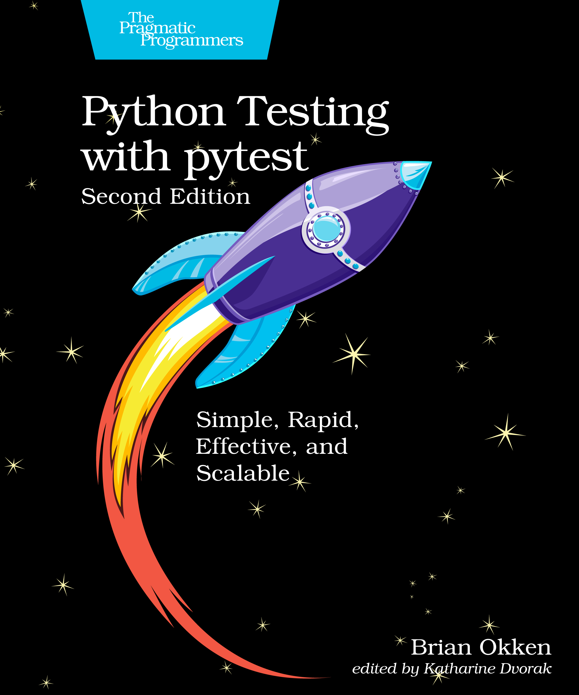
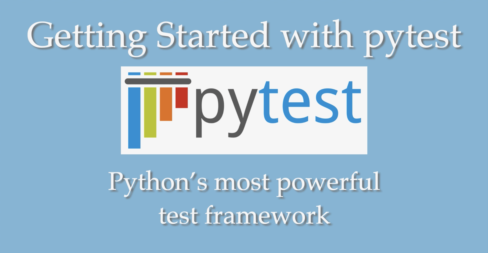
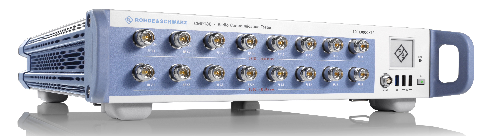
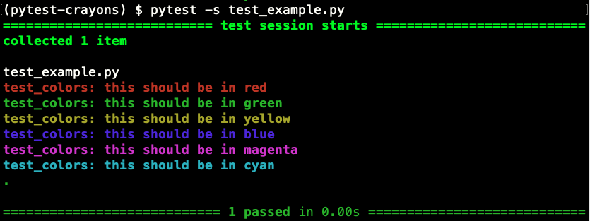
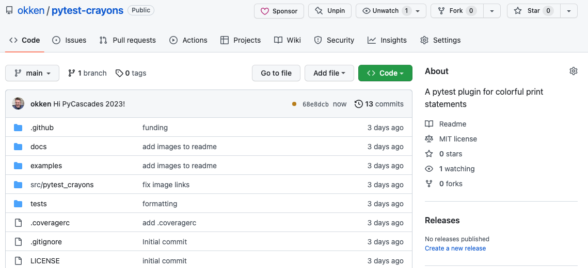
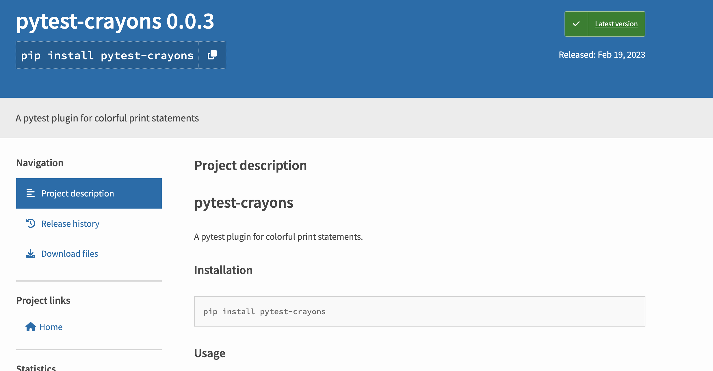

build-lists: true
footer: Brian Okken | pythontest.com/pycascades-2023 

# Sharing is Caring
## sharing pytest fixtures

[.text: alignment(center)]

#### _
### Brian Okken

[.hide-footer]

---

# Slides + Code 

[.text: alignment(center)]
## pythontest.com/pycascades-2023
[.hide-footer]

---

# Brian Okken 
[.build-lists: false]

[.column]
* Podcasts
  Python Bytes / Test & Code

[.column]
 
 

---

# Brian Okken 
[.build-lists: false]

[.column]
* Podcasts
  Python Bytes / Test & Code
* Books
  Python Testing with pytest

[.column]
  
 

---

# Brian Okken 
[.build-lists: false]

[.column]
* Podcasts
  Python Bytes / Test & Code
* Books
  Python Testing with pytest
* Training
  pythontest.com/courses
  pythontest.com/training

[.column]
  
 

---

# Brian Okken 
[.build-lists: false]

[.column]
* Podcasts
  Python Bytes / Test & Code
* Books
  Python Testing with pytest
* Training
  pythontest.com/courses
  pythontest.com/training
* Lead Software Engineer

[.column]
  
  
  

---
# System level testing
[.build-lists: false]
### Is what led me to pytest

  
 

---

# Why?

---


# Fixtures
[.column]
* Setup before a test: Connect, Reset, Configure, ...
* Teardown: Check logs, generate reports, ...
* Multilevel: Session, Package, Module, Class, Function, ...

[.column]
 
 
 


---
# fixtures are awesome
---
# pytest is awesome
---
# you are awesome
---
# you're here, right?
---
# you will make 
# fixtures so awesome 
# you want to share them

---

# Fixture crash course

---
# typical example

[.column]
```python
import pytest 

@pytest.fixture()
def db():
    ... # connect to db
    yield _db 
    ... # disconnect
```

---
# typical example

[.column]
```python
import pytest 

@pytest.fixture()
def db():
    ... # connect to db
    yield _db 
    ... # disconnect
```

[.column]
```python
def test_foo(db):
    ...
    result = db.action()
    ...

def test_bar(db):
    ...
    result = db.action()
    ...
```
---

# but frankly

---

# that's too useful for this talk

---

# How about 

---

# colorful print statements



---

# using fixtures

[.code-highlight: all]
[.code-highlight: 1, 8]

```python
def test_colors(red, green, yellow, blue, magenta, cyan):
    print("")  # for the newline
    red("this should be in red")
    green("this should be in green")
    yellow("this should be in yellow")
    blue("this should be in blue")
    magenta("this should be in magenta")
    cyan("this should be in cyan")
```

---
# cyan 
[.code-highlight: all]
[.code-highlight: 4-6]
[.code-highlight: 8]
[.code-highlight: 9]
[.code-highlight: 11-13]

```python
import pytest
from functools import partial

CYAN = "\x1b[36m"
RESET = "\x1b[0m"
BOLD = "\x1b[1m"

def _color_print(color: str, func_name: str, text: str):
    print(f"{BOLD}{color}{func_name}: {text}{RESET}")

@pytest.fixture()
def cyan(request):
    return partial(_color_print, CYAN, request.node.name)
```

---
# the rest

```python
@pytest.fixture()
def red(request):
    return partial(_color_print, RED, request.node.name)

@pytest.fixture()
def green(request):
    return partial(_color_print, GREEN, request.node.name)

@pytest.fixture()
def yellow(request):
    return partial(_color_print, YELLOW, request.node.name)

@pytest.fixture()
def blue(request):
    return partial(_color_print, BLUE, request.node.name)

@pytest.fixture()
def magenta(request):
    return partial(_color_print, MAGENTA, request.node.name)
```

---

# So that this

[.code-highlight: all]

```python
def test_colors(red, green, yellow, blue, magenta, cyan):
    print("")  # for the newline
    red("this should be in red")
    green("this should be in green")
    yellow("this should be in yellow")
    blue("this should be in blue")
    magenta("this should be in magenta")
    cyan("this should be in cyan")
```

---

# Produces this


--- 

# That was fun

---

# But they can't be shared 

---

# Yet

---
# They're in the test file

[.column]

```python
import pytest
from functools import partial

# Terminal color codes
RED = "\x1b[31m"
GREEN = "\x1b[32m"
YELLOW = "\x1b[33m"
BLUE = "\x1b[34m"
MAGENTA = "\x1b[35m"
CYAN = "\x1b[36m"
RESET = "\x1b[0m"
BOLD = "\x1b[1m"

def _color_print(color: str, func_name: str, text: str):
    print(f"{BOLD}{color}{func_name}: {text}{RESET}")

@pytest.fixture()
def red(request):
    return partial(_color_print, RED, request.node.name)

@pytest.fixture()
def green(request):
    return partial(_color_print, GREEN, request.node.name)
```

[.column]

```python
@pytest.fixture()
def yellow(request):
    return partial(_color_print, YELLOW, request.node.name)

@pytest.fixture()
def blue(request):
    return partial(_color_print, BLUE, request.node.name)

@pytest.fixture()
def magenta(request):
    return partial(_color_print, MAGENTA, request.node.name)

@pytest.fixture()
def cyan(request):
    return partial(_color_print, CYAN, request.node.name)

def test_colors(red, green, yellow, blue, magenta, cyan):
    print("")  # for the newline
    red("this should be in red")
    green("this should be in green")
    yellow("this should be in yellow")
    blue("this should be in blue")
    magenta("this should be in magenta")
    cyan("this should be in cyan")
```
---

# We need to set them free

----

# And put them in a conftest.py file

```
test_directory
├── conftest.py 
├── test_example.py 
└── test_example_two.py
```

---

# conftest.py

[.column]
```python
import pytest
from functools import partial

# Terminal color codes
RED = "\x1b[31m"
GREEN = "\x1b[32m"
YELLOW = "\x1b[33m"
BLUE = "\x1b[34m"
MAGENTA = "\x1b[35m"
CYAN = "\x1b[36m"
RESET = "\x1b[0m"
BOLD = "\x1b[1m"

def _color_print(color: str, func_name: str, text: str):
    print(f"{BOLD}{color}{func_name}: {text}{RESET}")

@pytest.fixture()
def red(request):
    return partial(_color_print, RED, request.node.name)


@pytest.fixture()
def green(request):
    return partial(_color_print, GREEN, request.node.name)

```

[.column]
```python

@pytest.fixture()
def yellow(request):
    return partial(_color_print, YELLOW, request.node.name)


@pytest.fixture()
def blue(request):
    return partial(_color_print, BLUE, request.node.name)


@pytest.fixture()
def magenta(request):
    return partial(_color_print, MAGENTA, request.node.name)


@pytest.fixture()
def cyan(request):
    return partial(_color_print, CYAN, request.node.name)

```

----
# test_example.py
```python
def test_colors(red, green, yellow, blue, magenta, cyan):
    print("")  # for the newline
    red("this should be in red")
    green("this should be in green")
    yellow("this should be in yellow")
    blue("this should be in blue")
    magenta("this should be in magenta")
    cyan("this should be in cyan")
```

---

# test\_example\_two.py

```python
def test_magenta(magenta):
    magenta("this should be in magenta")

def test_cyan(cyan):
    cyan("this should be in cyan")
```

----

# Now sharing works
## In the same directory

```
test_directory
├── conftest.py 
├── test_example.py 
└── test_example_two.py
```

----

# How about different directories?

---

# For tests in subdirectories
## It's still fine
[.code-highlight: all]
[.code-highlight: 2]

```
test_directory
├── conftest.py 
├── one
│   └── test_example.py
└── two
    └── test_example_two.py
```


---

# Multiple conftest.py files
## Still fine

[.code-highlight: all]
[.code-highlight: 1, 2, 3, 4, 6, 7]

```
test_directory
├── conftest.py 
├── one
|   ├── conftest.py
│   └── test_example.py
└── two
    ├── conftest.py
    └── test_example_two.py
```

---

# How about sharing between projects?

---

# This is where it gets fun

---

# Before I show you the next couple of slides

* promise you won't run away
* it's actually not as bad as it seems at first

---
# We're going to start here

[.column]
```
test_directory
├── conftest.py 
├── test_example.py 
└── test_example_two.py
```

--- 

# And move to

[.column]
```
test_directory
├── conftest.py 
├── test_example.py 
└── test_example_two.py
```
[.column]

```
pytest-crayons
├── LICENSE
├── README.md
├── examples
│   └── test_example.py
├── pyproject.toml
├── src
│   └── pytest_crayons
│       ├── __init__.py
│       └── plugin.py
├── tests
│   ├── conftest.py
│   └── test_colors.py
└── tox.ini
```

---

# Yes. We're going to talk about
# Packaging pytest Plugins

---

# Trust me
## it's not that bad

---

# Another overview

[.column]
```
test_directory
├── conftest.py 
├── test_example.py 
└── test_example_two.py
```
[.column]

```
pytest-crayons
├── LICENSE
├── README.md
├── examples
│   └── test_example.py
├── pyproject.toml
├── src
│   └── pytest_crayons
│       ├── __init__.py
│       └── plugin.py
├── tests
│   ├── conftest.py
│   └── test_colors.py
└── tox.ini
```
---
# Fixtures: conftest.py -> plugin.py

[.column]
[.code-highlight: 2]
```
test_directory
├── conftest.py 
├── test_example.py 
└── test_example_two.py
```
[.column]
[.code-highlight: 11]
```
pytest-crayons
├── LICENSE
├── README.md
├── examples
│   ├── test_example.py
│   └── test_example_two.py
├── pyproject.toml
├── src
│   └── pytest_crayons
│       ├── __init__.py
│       └── plugin.py
├── tests
│   ├── conftest.py
│   └── test_colors.py
└── tox.ini
```

---
# examples -> examples

[.column]
[.code-highlight: 3,4]
```
test_directory
├── conftest.py 
├── test_example.py 
└── test_example_two.py
```

[.column]
[.code-highlight: 4,5,6]
```
pytest-crayons
├── LICENSE
├── README.md
├── examples
│   ├── test_example.py
│   └── test_example_two.py
├── pyproject.toml
├── src
│   └── pytest_crayons
│       ├── __init__.py
│       └── plugin.py
├── tests
│   ├── conftest.py
│   └── test_colors.py
└── tox.ini
```

---

# New stuff
[.code-highlight: 2,3,7,12-14,15]
```
pytest-crayons
├── LICENSE
├── README.md
├── examples
│   ├── test_example.py
│   └── test_example_two.py
├── pyproject.toml
├── src
│   └── pytest_crayons
│       ├── __init__.py
│       └── plugin.py
├── tests
│   ├── conftest.py
│   └── test_colors.py
└── tox.ini
```

---

# LICENSE

[.code-highlight: 2]
```
pytest-crayons
├── LICENSE
├── README.md
├── examples
│   ├── test_example.py
│   └── test_example_two.py
├── pyproject.toml
├── src
│   └── pytest_crayons
│       ├── __init__.py
│       └── plugin.py
├── tests
│   ├── conftest.py
│   └── test_colors.py
└── tox.ini
```
---

# Whatever you want

```
The MIT License (MIT)

Copyright (c) 2023, Brian Okken

Permission is hereby granted, free of charge, ...
```

---

# README.md

[.code-highlight: 3]
```
pytest-crayons
├── LICENSE
├── README.md
├── examples
│   ├── test_example.py
│   └── test_example_two.py
├── pyproject.toml
├── src
│   └── pytest_crayons
│       ├── __init__.py
│       └── plugin.py
├── tests
│   ├── conftest.py
│   └── test_colors.py
└── tox.ini
```

---
[.build-lists: false ]

# README.md

[.column]
```
# pytest-crayons

A pytest plugin for colorful print statements.

## Installation

...

## Usage

...

```
[.column]
I like to include

* what it does
* how to install
* an example

---

# pyproject.toml

[.code-highlight: 7]
```
pytest-crayons
├── LICENSE
├── README.md
├── examples
│   ├── test_example.py
│   └── test_example_two.py
├── pyproject.toml
├── src
│   └── pytest_crayons
│       ├── __init__.py
│       └── plugin.py
├── tests
│   ├── conftest.py
│   └── test_colors.py
└── tox.ini
```
---

# Let's come back to that

---

# \_\_init\_\_.py

[.code-highlight: 10]
```
pytest-crayons
├── LICENSE
├── README.md
├── examples
│   ├── test_example.py
│   └── test_example_two.py
├── pyproject.toml
├── src
│   └── pytest_crayons
│       ├── __init__.py
│       └── plugin.py
├── tests
│   ├── conftest.py
│   └── test_colors.py
└── tox.ini
```

---

# \_\_init\_\_.py 

[.column]
[.code-highlight: 10]
```
pytest-crayons
├── LICENSE
├── README.md
├── examples
│   ├── test_example.py
│   └── test_example_two.py
├── pyproject.toml
├── src
│   └── pytest_crayons
│       ├── __init__.py
│       └── plugin.py
├── tests
│   ├── conftest.py
│   └── test_colors.py
└── tox.ini
```

[.column]
```python
__version__ = "0.0.1"
```
---
# more tests and tox

[.code-highlight: 12-15]
```
pytest-crayons
├── LICENSE
├── README.md
├── examples
│   ├── test_example.py
│   └── test_example_two.py
├── pyproject.toml
├── src
│   └── pytest_crayons
│       ├── __init__.py
│       └── plugin.py
├── tests
│   ├── conftest.py
│   └── test_colors.py
└── tox.ini
```
---

# Let's go back to
# pyproject.toml

---

# pyproject.toml

[.code-highlight: 7]
```
pytest-crayons
├── LICENSE
├── README.md
├── examples
│   ├── test_example.py
│   └── test_example_two.py
├── pyproject.toml
├── src
│   └── pytest_crayons
│       ├── __init__.py
│       └── plugin.py
├── tests
│   ├── conftest.py
│   └── test_colors.py
└── tox.ini
```
---

# Now's a good time for a 
# deep breath

---

[.code-highlight: all]

# pyproject.toml 

```toml
[project]
name = "pytest-crayons"
description = "A pytest plugin for colorful print statements"
readme = "README.md"
license = {file = "LICENSE"}
requires-python = ">3.7"
dynamic = ["version"]
authors = [{name = "Brian Okken"}]
dependencies = ["pytest"]
classifiers = ["Framework :: Pytest"]

[project.urls]
Home = "https://github.com/okken/pytest-crayons"

[project.entry-points.pytest11]
pytest_crayons = "pytest_crayons.plugin"

[build-system]
requires = ["flit_core >=3.2,<4"]
build-backend = "flit_core.buildapi"

[tool.flit.module]
name = "pytest_crayons"
```

---

[.code-highlight: 1-10]

# Project

```toml
[project]
name = "pytest-crayons"
description = "A pytest plugin for colorful print statements"
readme = "README.md"
license = {file = "LICENSE"}
requires-python = ">3.7"
dynamic = ["version"]
authors = [{name = "Brian Okken"}]
dependencies = ["pytest"]
classifiers = ["Framework :: Pytest"]

[project.urls]
Home = "https://github.com/okken/pytest-crayons"

[project.entry-points.pytest11]
pytest_crayons = "pytest_crayons.plugin"

[build-system]
requires = ["flit_core >=3.2,<4"]
build-backend = "flit_core.buildapi"

[tool.flit.module]
name = "pytest_crayons"
```
---
[.build-lists: false]

# Project 


```toml
[project]
name = "pytest-crayons"
description = "A pytest plugin for colorful print statements"
readme = "README.md"
license = {file = "LICENSE"}
requires-python = ">3.7"
dynamic = ["version"]
authors = [{name = "Brian Okken"}]
dependencies = ["pytest"]
classifiers = ["Framework :: Pytest"]
```

----

[.code-highlight: 12-13]

# URL

```toml
[project]
name = "pytest-crayons"
description = "A pytest plugin for colorful print statements"
readme = "README.md"
license = {file = "LICENSE"}
requires-python = ">3.7"
dynamic = ["version"]
authors = [{name = "Brian Okken"}]
dependencies = ["pytest"]
classifiers = ["Framework :: Pytest"]

[project.urls]
Home = "https://github.com/okken/pytest-crayons"

[project.entry-points.pytest11]
pytest_crayons = "pytest_crayons.plugin"

[build-system]
requires = ["flit_core >=3.2,<4"]
build-backend = "flit_core.buildapi"

[tool.flit.module]
name = "pytest_crayons"
```
---

# URL

```toml
[project.urls]
Home = "https://github.com/okken/pytest-crayons"
```

----

[.code-highlight: 15-16]

# pytest entry point

```toml
[project]
name = "pytest-crayons"
description = "A pytest plugin for colorful print statements"
readme = "README.md"
license = {file = "LICENSE"}
requires-python = ">3.7"
dynamic = ["version"]
authors = [{name = "Brian Okken"}]
dependencies = ["pytest"]
classifiers = ["Framework :: Pytest"]

[project.urls]
Home = "https://github.com/okken/pytest-crayons"

[project.entry-points.pytest11]
pytest_crayons = "pytest_crayons.plugin"

[build-system]
requires = ["flit_core >=3.2,<4"]
build-backend = "flit_core.buildapi"

[tool.flit.module]
name = "pytest_crayons"
```
---

# pytest entry point

```toml
[project.entry-points.pytest11]
pytest_crayons = "pytest_crayons.plugin"
```

---
# pytest entry point
```toml
[project.entry-points.pytest11]
pytest_crayons = "pytest_crayons.plugin"
```
[.code-highlight: all]
[.code-highlight: 3,5]
```
...
├── src
│   └── pytest_crayons
│       ├── __init__.py
│       └── plugin.py
...
```

----

[.code-highlight: 18-20]

# Build system

```toml
[project]
name = "pytest-crayons"
description = "A pytest plugin for colorful print statements"
readme = "README.md"
license = {file = "LICENSE"}
requires-python = ">3.7"
dynamic = ["version"]
authors = [{name = "Brian Okken"}]
dependencies = ["pytest"]
classifiers = ["Framework :: Pytest"]

[project.urls]
Home = "https://github.com/okken/pytest-crayons"

[project.entry-points.pytest11]
pytest_crayons = "pytest_crayons.plugin"

[build-system]
requires = ["flit_core >=3.2,<4"]
build-backend = "flit_core.buildapi"

[tool.flit.module]
name = "pytest_crayons"
```
---

# Build system
```toml
[build-system]
requires = ["flit_core >=3.2,<4"]
build-backend = "flit_core.buildapi"
```
----

[.code-highlight: 22-23]

# Module

```toml
[project]
name = "pytest-crayons"
description = "A pytest plugin for colorful print statements"
readme = "README.md"
license = {file = "LICENSE"}
requires-python = ">3.7"
dynamic = ["version"]
authors = [{name = "Brian Okken"}]
dependencies = ["pytest"]
classifiers = ["Framework :: Pytest"]

[project.urls]
Home = "https://github.com/okken/pytest-crayons"

[project.entry-points.pytest11]
pytest_crayons = "pytest_crayons.plugin"

[build-system]
requires = ["flit_core >=3.2,<4"]
build-backend = "flit_core.buildapi"

[tool.flit.module]
name = "pytest_crayons"
```
---

# Module 

[.column]
```toml
[tool.flit.module]
name = "pytest_crayons"
```

---

# Module 

[.column]
```toml
[tool.flit.module]
name = "pytest_crayons"
```
[.code-highlight: all]
[.code-highlight: 3]
```
...
├── src
│   └── pytest_crayons
│       ├── __init__.py
│       └── plugin.py
...
```


---

# Module 

[.column]
```toml
[tool.flit.module]
name = "pytest_crayons"
```
[.code-highlight: 3]
```
...
├── src
│   └── pytest_crayons
│       ├── __init__.py
│       └── plugin.py
...
```

[.column]
```toml
[project]
name = "pytest-crayons"
```

---
# Flit based pyproject.toml

[.code-highlight: all]
```toml
[project]
name = "pytest-crayons"
description = "A pytest plugin for colorful print statements"
readme = "README.md"
license = {file = "LICENSE"}
requires-python = ">3.7"
dynamic = ["version"]
authors = [{name = "Brian Okken"}]
dependencies = ["pytest"]
classifiers = ["Framework :: Pytest"]

[project.urls]
Home = "https://github.com/okken/pytest-crayons"

[project.entry-points.pytest11]
pytest_crayons = "pytest_crayons.plugin"

[build-system]
requires = ["flit_core >=3.2,<4"]
build-backend = "flit_core.buildapi"

[tool.flit.module]
name = "pytest_crayons"
```

---
# Needs to change for hatch/setuptools

[.code-highlight: 18-23]
```toml
[project]
name = "pytest-crayons"
description = "A pytest plugin for colorful print statements"
readme = "README.md"
license = {file = "LICENSE"}
requires-python = ">3.7"
dynamic = ["version"]
authors = [{name = "Brian Okken"}]
dependencies = ["pytest"]
classifiers = ["Framework :: Pytest"]

[project.urls]
Home = "https://github.com/okken/pytest-crayons"

[project.entry-points.pytest11]
pytest_crayons = "pytest_crayons.plugin"

[build-system]
requires = ["flit_core >=3.2,<4"]
build-backend = "flit_core.buildapi"

[tool.flit.module]
name = "pytest_crayons"
```
---

# flit
```toml

[build-system]
requires = ["flit_core >=3.2,<4"]
build-backend = "flit_core.buildapi"

[tool.flit.module]
name = "pytest_crayons"
```

---
# hatch

```toml
[build-system]
requires = ["hatchling"]
build-backend = "hatchling.build"

[tool.hatch.version]
path = "src/pytest_crayons/__init__.py"
```
---

# setuptools

```toml
[build-system]
requires = ["setuptools>=61.0"]
build-backend = "setuptools.build_meta"

[tool.setuptools.dynamic]
version = {attr = "pytest_crayons.__version__"}
```

---
# That wasn't too bad, was it?
---

# Guess what?

---

# We can share our code now

---

# Seriously
## We could just push to a git repo now 

---



---
# GitHub, GitLab, BitBucket or wherever
---

# Your plugin is now installable 

```shell
$ pip install git+https://github.com/okken/pytest-crayons.git
```

---

# Even usable with `requirements.txt`

requirements.txt:
```
...
pytest
git+https://github.com/okken/pytest-crayons.git
tox
...
```

```shell
$ pip install -r requirements.txt
```

---

# `pip install` builds the wheel 

[.code-highlight: 1, 10]

```shell 
$ pip install git+https://github.com/okken/pytest-crayons.git
Collecting ...
  Cloning ...
  Running command git clone ...
  Resolved ...
  Installing build dependencies ... done
  Getting requirements to build wheel ... done
  Preparing metadata (pyproject.toml) ... done
Building wheels for collected packages: pytest-crayons
  Building wheel for pytest-crayons (pyproject.toml) ... done
  Created wheel for pytest-crayons: ...
Successfully built pytest-crayons
Installing collected packages: pytest-crayons
Successfully installed pytest-crayons-0.0.1
```

---

# So hopefully the build works

---

# Maybe
# some testing
# before we push
---

# tox (or nox)

[.code-highlight: 10]

```
pytest-crayons
...
├── src
│   └── pytest_crayons
│       ├── __init__.py
│       └── plugin.py
├── tests
│   ├── conftest.py
│   └── test_colors.py
└── tox.ini
```
---

# You promised 
# you wouldn't run away

---
# tox.ini

[.code-highlight: 10]

```
pytest-crayons
...
├── src
│   └── pytest_crayons
│       ├── __init__.py
│       └── plugin.py
├── tests
│   ├── conftest.py
│   └── test_colors.py
└── tox.ini

```

---

# tox.ini 

[.code-highlight: all] 
[.code-highlight: 1,2]
[.code-highlight: 1,3]
[.code-highlight: 1,4]
[.code-highlight: 6-8]
[.code-highlight: 10-13]

```ini
[tox]
envlist = py37, py38, py39, py310, py311,
skip_missing_interpreters = true
isolated_build = True

[testenv]
commands = pytest 
description = Run pytest

[pytest]
testpaths = 
    examples
    tests
```

---

# Running tox
[.build-lists: false]
[.column]
For example

```shell
$ pip install tox
$ tox -e py310
```

or all environments

```shell
$ tox
```
[.column]

* creates a new empty virtual environment
* builds a wheel
* installs all dependencies
* installs your code
* runs the tests 

---
# tox example


---
# tests

[.code-highlight: 6-8]
[.code-highlight: 2-8]
```
...
├── examples
│   ├── test_example.py
│   └── test_example_two.py
...
├── tests
│   ├── conftest.py
│   └── test_colors.py
└── tox.ini

```

---
# tests/conftest.py

```python
pytest_plugins = "pytester"
```


---
# tests/test_colors.py

[.code-highlight: all] 
[.code-highlight: 1] 
[.code-highlight: 2] 
[.code-highlight: 3] 
[.code-highlight: 4] 
[.code-highlight: 5-14] 

```python
def test_colors_get_printed(pytester):
    pytester.copy_example("examples/test_example.py")
    pytester.makepyfile(__init__ = "")
    result = pytester.runpytest("-s")
    result.stdout.fnmatch_lines(
        [
            "*[31mtest_colors: this should be in red*[0m",
            "*[32mtest_colors: this should be in green*[0m",
            "*[33mtest_colors: this should be in yellow*[0m",
            "*[34mtest_colors: this should be in blue*[0m",
            "*[35mtest_colors: this should be in magenta*[0m",
            "*[36mtest_colors: this should be in cyan*[0m",
        ],
    )

```


---

# We're testing a lot

* We're testing
    * the examples using the fixtures
    * the actual ouptut of the running tests
    * including the color ASCII codes
    * packaging, installing, and dependencies
    * on multiple versions of Python

---

# ahhh. confidence.

---

# Is it ready for PyPI?

---

# Actually, yes.

---



---

# We won't go through those details

But essentially it's:

* Register for an account on test.pypi.org / pypi.org 
* Use tool of your choice to push to TestPyPI / PyPI:
    * `flit publish`
    * `hatch publish`
    * `twine upload dist/*`

---

# Absolutely don't want PyPI?

---
# Preventing PyPI upload

[.code-highlight: all]
```toml
classifiers = [
    "Framework :: Pytest",
    "Private :: Do Not Upload" 
    ]
```

PyPI will always reject packages with classifiers beginning with `"Private ::"`.  - pypi.org/classifiers

*Learned this from Brett Cannon*

---

# We covered

[.column]
* pytest fixtures
* conftest.py for sharing fixtures
* creating a pytest plugin
* packing with flit, hatch, setuptools
* sharing via git repository

[.column]
* tox for testing on multiple Python versions 
    * functionality, packaging, and dependencies
* using pytester to test pytest plugins
* uploading to PyPI


---

# Not too bad, was it?

---

# If you want to know more about 
## building and testing fixtures and plugins

---

[.build-lists: false]

[.column]

See:

* Ch 3 for fixtures
* Ch 15 for building plugins
* Ch 11 includes 
    * tox 
    * GitHub Actions

[.column]


---
[.build-lists: false]
[.autoscale: true]

# Keep in touch

[.column]
* [pythontest.com](https://pythontest.com)
  training, courses, book
* [pythonbytes.fm](https://pythonbytes.fm)
  Python news and headlines directly to your earbuds
* [testandcode.com](https://testandcode.com)
  Coding with automation
* [testandcode.com/contact](https://testandcode.com/contact)
  Email contact form
* [@brianokken@fosstodon.org](https://fosstodon.org/@brianokken)
  Mastodon 
  

[.column]
  
 