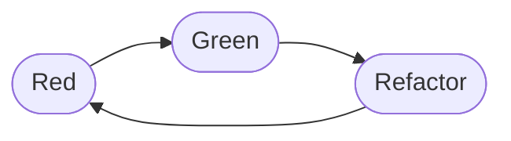

build-lists: true
footer: Brian Okken | pythontest.com/tdd-pybay-2026 

# Is TDD Still Relevant?
## Yes, but don't be dumb about it.

[.text: alignment(center)]

#### _
### Brian Okken

[.hide-footer]

---

# Slides

[.text: alignment(center)]

## pythontest.com/tdd-pybay-2026 
[.hide-footer]

---

# Brian Okken - Podcasts
[.build-lists: false]

[.column]

* Test and Code (2015 - 2025)
* Python Bytes (2016 - 2026)
* Python People (2023 - 2024)

[.column]
 
 

---

# Python People will Return
 

[.text: alignment(center)]
[.hide-footer]
[pythonpeople.pythontest.com](https://pythonpeople.pythontest.com)

### Previous Guests

[.column]

Michael Kennedy
Paul Everitt
Brett Cannon
Barry Warsaw
Bob Belderbos

[.column]
Naomi Ceder
Mariatta Wijaya
Carlton Gibson
Will Vincent
Julian Sequeira

[.column]
Pamela Fox
Nikita Karamov
Rob Ludwick
Shauna Gordon-McKeon

---

# Brian Okken - Books
[.build-lists: false]

[.column]
* Python Testing with pytest
* Lean TDD

[.column]
 

---

# Brian Okken - Courses
[.build-lists: false]

[.column]
[courses.pythontest.com](https://courses.pythontest.com)

[.column]

---

# Brian Okken - Lead Software Engineer
[.build-lists: false]

[.column]
* Currently at Rohde & Schwarz 
* Wireless Communication
* Measurements
* Embedded Code :  C++ 
* Testing : Python + pytest

[.column]
 
 

---

# Satellite & Component Test Systems

* Racks 1-4 wide, full of instruments, cables, signal switch boxes
* Small team, each an expert in something different
* Few scheduled meetings - mostly ad hoc, as needed
* Close proximity, high cube walls for focused work
* Direct access to a domain expert with real customer experience

^We got a lot right, but not testing. No automated tests - manual, and only by us. No separate QA. Manual testing sucks. But there was one release: the code shipped on the computer in the rack.

---

# Spectrum Analyzer
## CDMA Cellular Measurements

* First phones without a huge battery pack
* Worked closely with the DSP engineer - UI down to hardware
* Lots of automation in our process to speed up coding
* Separate QA team, but we coded bones-out / tracer-bullet style
* QA wrote tests while we developed - tests lagged by ~1 week
* A rep sat in our team meetings; docs writers found great defects

^It's great to fix a sucky API before it hits a customer. This job is where "bones-out" first clicked for me as a way to let testing keep pace with development.

---

# Communication Test Box

* Signal generator + full protocol stack + spectrum analyzer + receive stack
* Essentially: acts as a cell tower and full backend to test wireless devices
* Super fun. Super complex. Lots of people, teams, hardware, code.
* This is where I learned TDD and tried to apply it myself
* Separate QA team again

^I wanted my code working before it went to QA - tired of manually testing my own stuff. But large, multi-team orgs breed inefficiency.

---

# The Bug Report Loop

* I think I've tested my code
* Days/weeks later: a bug report from QA finds its way to me
* I can't run their failing test - no access to their dedicated racks
* So: manually reproduce, or write a small snippet to repro
* If I can't repro: try a fix, hope, ask a test engineer to check

^I wanted to run those final validation tests myself. It would've been so much easier to do the work right the first time if we'd had those tests during development. I really did think TDD was about that. The way most people teach it, it's not.

---

# A Detour: Oscilloscopes

* Took a break, worked on oscilloscope coding for a while
* Introduced that team to automated test suites during development

^Quick beat - just enough to show the idea kept traveling with me.

---

# Back to Comms Testing, at R&S

* Where I am now
* No separate QA - the dev team does the testing
* So I got to decide how to do this efficiently
* That's the punchline of this talk: **Lean TDD**

^We're going to move through this fast, but you can go at your own pace with a copy of the book - or better, grab the paperback + audiobook, read by yours truly.

---
# TDD
## Is TDD Still Relevant?

^Ask the room directly. Let the silence/mumbling set up the "yes, but don't be dumb" punchline.

---

# TDD
## Is TDD Still Relevant?
## Yes, but don't be dumb about it.

^Reveal the actual thesis. This is the talk in one sentence - keep coming back to it.

---

# We're going to cover

* Why coding with tests is faster and easier than without tests
* Why I think that (a little career history)
* Why TDD matters more now than ever, with AI in the mix
* How to do TDD in a sane way
* And, in contrast, how to do it in an insane way (according to me)

^Set expectations for the arc of the talk so the audience has a map.

---

# Show of Hands

* Who thinks they already know what TDD is?
* Who's actually tried it?
* Who thinks it's more trouble than it's worth?

^Get hands up 3 times. Keep it fast, don't let it turn into a discussion yet - just a pulse check to reference later ("remember when you raised your hand...").

---

# Classic TDD

## Extreme Programming's "test first"

^Quick history: XP (late 90s) -> "test first programming" -> TDD after Kent Beck's 2002 book. Ask "who's tried Extreme Programming? Still doing it?" as one more quick hand-raise.

---

# Classic TDD

* Red - write a failing test
* Green - simplest code to make it (and everything else) pass
* Refactor - clean it up

^This is the shorthand everyone remembers. It's from the book's preface, repeated throughout, so it's no surprise it's what stuck. But it's incomplete.

---

# What the book actually says

1. Quickly add a test.
2. Run all tests and see the new one fail.
3. Make a little change.
4. Run all the tests and see them all succeed.
5. Refactor to remove duplication.

^Read almost like pseudo-code. Note there's a missing piece even here...

---

# The missing piece

## A running list of test cases

* Kent keeps a brainstormed list the whole way through the book
* Crosses items off as he implements them
* Adds new ones as he thinks of them
* That list quietly answers "what's next?" and "when am I done?"

^This list almost never makes it into how people describe/teach TDD. Red/Green/Refactor alone leaves big questions open.

---

# Red/Green/Refactor leaves questions

* What does "simplest code" mean?
* How do I know what test to write next?
* When am I actually done?

^Because these questions went unanswered, a lot of coaches and trainers stepped in with their own answers - and that's where it got weird (foreshadow "alternative approaches" section).

---

# Canon TDD

## 2023 - 21 years later

<!-- picture idea: portrait or book cover of "Test Driven Development By Example", or a simple timeline 2002 -> 2023 -->

^Kent Beck wrote "Canon TDD" to clarify what he actually meant. I asked if I could quote it verbatim - he said summarize it in my own words instead, so here's my summary.

---

# Canon TDD

1. Write a list of test cases you think you need.
2. Pick one, write a test function for it.
3. Write/modify code until the whole suite, including the new test, passes.
4. Optionally refactor.
5. Add any newly-discovered test cases to the list.
6. Repeat from step 2 until the list is empty.

^Less catchy than Red/Green/Refactor, but it matches the book's actual workflow. The list is explicit. Refactor is explicitly optional - you don't have to write bad code on purpose. And notice: no "simplest code possible" language anymore.

---

# The Promise of TDD

* TDD is an Agile practice
* Should also be "agile" - lowercase a
  - active, light, swift, nimble
  - able to change direction quickly
* Sounds good... should make us faster, right?

^Set up the turn: this is the promise. Next section is where it went sideways.

---

# Where TDD Went Sideways

## Separating system tests from unit tests

[.column]
### Then
* GUI testing: fiddly pixel mapping, cumbersome scripts

[.column]
### Now
* Playwright: fast, not pixel-level
* (Testable UI design is still its own skill)

^APIs, though, have always been awesome to test. The problem in the 90s wasn't testing philosophy, it was that fewer systems had an architecture where you could exercise the whole system through an API.

---

# Where TDD Went Sideways

## QA dept vs. Development

* A great test engineer is a great software engineer, **plus**:
  - communication & clear writing skills
  - deciphering vague requirements from stakeholders
  - leading by example
  - rapid task switching
* That's a superset of dev skills, not a subset
* (Wage disparities in some companies don't help either)

^Some companies get this right. Let's put a pin in the rant and move on - don't dwell here live.

---

# Where TDD Went Sideways

## Fixation on fast tests

[.column]
### Then
* Devs ran suites manually
* Slow = skipped

[.column]
### Now
* Only the tests for what you're touching need to be fast
* Rest can run in CI
* "Fast" is relative to the project

---

# Where TDD Went Sideways

## Fixation on testing functions over APIs

* This is where the real chaos starts
* Refactor: move responsibility between subsystems, split a class in two...
* Function-level test suite: havoc
* API-level test suite: **no test changes necessary**

^This is the big one - the crux of the whole talk. Consider pausing/repeating this slide's point.

---

# Alternative Approaches

* London / Mockist TDD
* BDD (Behavior Driven Development)
* ATDD (Acceptance Test Driven Development)
* Lean TDD

^Quick tour of each, with a clear point of view on each.

---

# London / Mockist TDD

* Outside-in, mocks used as a design tool
* So. Much. Work.
* Tests implementation, not behavior
* Tests are hard to read
* Refactoring requires rewriting the scaffolding

^Credit where due: London style is what pulled acceptance tests into the TDD conversation in the first place. That idea survives into BDD, ATDD, and Lean TDD.

---

# BDD
## Behavior Driven Development

* Behaviors: yay!
* Gherkin: boo!
* Given / When / Then

^BDD-the-mindset (Dan North) is great: name tests after behavior, think in Given/When/Then. BDD-with-Gherkin turns acceptance criteria into code and requires an interpreter layer - extra process, extra handoffs, less learning. Keep the mindset, skip the pickles.

---

# ATDD
## Acceptance Test Driven Development

* A **team** workflow, not just a solo one
* Acceptance criteria -> acceptance tests -> production code
* Great at describing team collaboration
* ...but says nothing about building the subsystems and units underneath

^This is very close to Lean TDD at the top level. The gap it leaves - what do you do below the acceptance test layer - is exactly what Lean TDD fills in.

---

# Lean TDD
## a.k.a. "Unified Field Theory for TDD"

* ATDD at the top
* Subsystem/unit testing only as needed
* One test suite if at all possible
* Room for developers *and* test engineers
* Don't be wasteful. Ceremony as necessary.
* The testing trophy - that rocks

^This is the payoff of the whole "alternative approaches" tour - it's what I landed on after living through all the others.

---

# Lean TDD: Test at the Highest Level Reasonable

* Minimizes rework when refactoring
* Which encourages refactoring - and second drafts
* Stop shipping your first draft!
  - Terrible practice for blog posts and homework
  - Never done for books
  - Why do it with software?

^This is the "so what" - refactoring-friendly tests are what let you actually revise your work.

---

# Lean TDD: Let Everyone Run Every Test

* Minimize overlap of testing across levels
* Run tests locally if at all possible

^Story: shared pool of hardware instruments. Reserve one matching a bug report, run the failing test locally, debug, grab logs. Compare to the old back-and-forth: "how did you set it up?", "how do I run this?", "try it again on x.y.z", "turn on logging BLAH and rerun" - that's pure waste. Let the developer run the test and poke at it themselves.

---

# Coding and Testing with AI

* Care what the system does -> write/review tests at that level
* Care about your part of the system -> write/review tests there too
* Willing to not review some AI-written code?
  - Then decide if you need to review *its tests*
  - Only safe if you trust the tests above it
* Fixed, "do not modify" tests at higher levels = freedom below
  - For AI, agents, subcontractors, interns, whoever

^The guardrail framing: high level tests you trust let lower layers be a black box you don't have to personally review.

---

# Have Agents Use TDD

* Give agents a spec + a specific test suite to run
* Huge win: I'm not manually re-testing after every change
  - Same experience as QA <-> dev, except now I'm QA
* If an agent writes the high-level tests too:
  - I still review them against my own understanding
  - Agent keeps re-running them while it debugs/fixes

^Equivalent to letting developers run tests QA already built - except the "QA" here can be me directing an agent.

---

# Value & Waste

* Lean: waste = anything that doesn't *directly* add value to the customer
* We can't eliminate all waste
* Tests are waste, in the strict Lean sense
  - (yes, throw your tomatoes)
* So: minimize tests, maximize value

^Let that land for a second before moving to the trophy - it's meant to be a little provocative.

---

# The Test Pyramid
## Mike Cohn, 2009

<!-- picture: resources/pyramid-original.jpeg (Lean TDD book) - "UI / Service / Unit" -->

* Top: UI tests
* Middle: Service tests
* Base: Unit tests

^Point was actually "do more service/API tests, UI testing is painful, don't do much of it." Most people heard "do mostly unit tests" instead.

---

# The Misunderstood Pyramid

<!-- picture: resources/pyramid-common.jpeg (Lean TDD book) - "E2E / Integration / Unit" -->

* Top: E2E tests -> "avoid these"
* Middle: Integration tests -> "someone else's problem"
* Base: Unit tests -> "do mostly this"

^This version is the one that did the damage. E2E isn't inherently brittle - APIs shouldn't be brittle at all. If your API-level tests are brittle, your product is brittle, not your tests.

---

# Flip It

<!-- picture: resources/pyramid-flipped.jpeg (Lean TDD book) -->

* Large top: System API tests
* Middle: Subsystem / component tests
* Small point at bottom: unit tests

^"Ice cream cone anti-pattern" objection = mostly manual regression testing with almost no automation at all. Not the same thing as deliberately choosing to test through stable APIs.

---

# The Testing Trophy
## Kent C. Dodds

<!-- picture: resources/trophy-original.jpeg (Lean TDD book) -->

* Top (small): E2E / UI tests
* Bulk: Integration tests (~system-level, no UI)
* Narrow stem: Unit tests
* Base: Static analysis

^"Write tests. Not too many. Mostly integration." - riff on Michael Pollan's "Eat food. Not too much. Mostly plants." First shape that actually convinced people the pyramid was wrong.

---

# My Recommendation

<!-- picture: resources/trophy-preferred.jpeg (Lean TDD book) -->

* Static analysis - don't skip linting
* A few focused unit/component tests for gnarly bits
* **Bulk of tests at the highest API that makes sense**
* Some UI tests - to test the UI, not the whole system

^This is the shape I actually use, on personal projects, open source, and at work.

---

# Shifting to Higher Level Tests

* "Unified Field Theory" because it treats the whole test stack as one thing
* No redundant tests across levels
* Test at the highest level possible
  - Maximizes zero-test-rework refactoring potential

^Tie back to the earlier "function-level tests wreck refactors" slide - this is the fix.

---

# Which Test Would You Rather See Fail?

* Test A: a unit test some dev thought was important once
* Test B: a system test tied directly to a customer requirement

^Ask the room. If your system-level acceptance tests are thorough, a passing system suite plus one failing unit test is a much better place to be than the reverse. I still investigate unit test failures - I've even written my own tests stricter than the real requirement. But requirement-tied system tests are the ones I trust most.

---

# Applying Lean TDD with Agents

* Keep everything in source control
* Instruct agents: don't delete tests, don't loosen assertions to force green
* Instruct agents: ask before modifying existing test code
* Always review test diffs before merging
* Review every new test, especially ones tied to acceptance criteria

^Real failure modes I've seen: tests that don't actually check the outcome, agents quietly weakening assertions, tests deleted so the suite passes. Treat agent-written code like an open source contribution - grateful for the help, but you're the one maintaining it.

---

# RTFM

* The book is ~100 pages
* Audio book is short too (works great at 1.2-1.5x)
* [leantdd.com](https://leantdd.com)

^Plug Python People rebooting too if there's time.

---
[.build-lists: false]
[.autoscale: true]

# Contact

[.column]
* [leantdd.com](https://leantdd.com)
  Lean TDD book
  paperback, digital, and audio versions
* [pythontest.com](https://pythontest.com)
  training, courses, book
* [@brianokken@fosstodon.org](https://fosstodon.org/@brianokken)
  Mastodon 
* [@brianokken@fosstodon.org](https://fosstodon.org/@brianokken)
  Bluesky
  

[.column]
  
