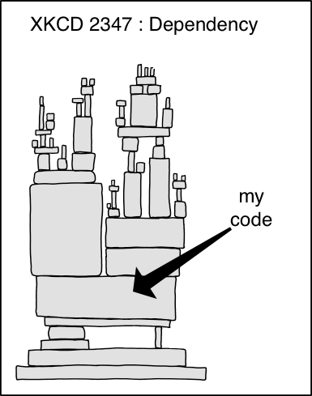
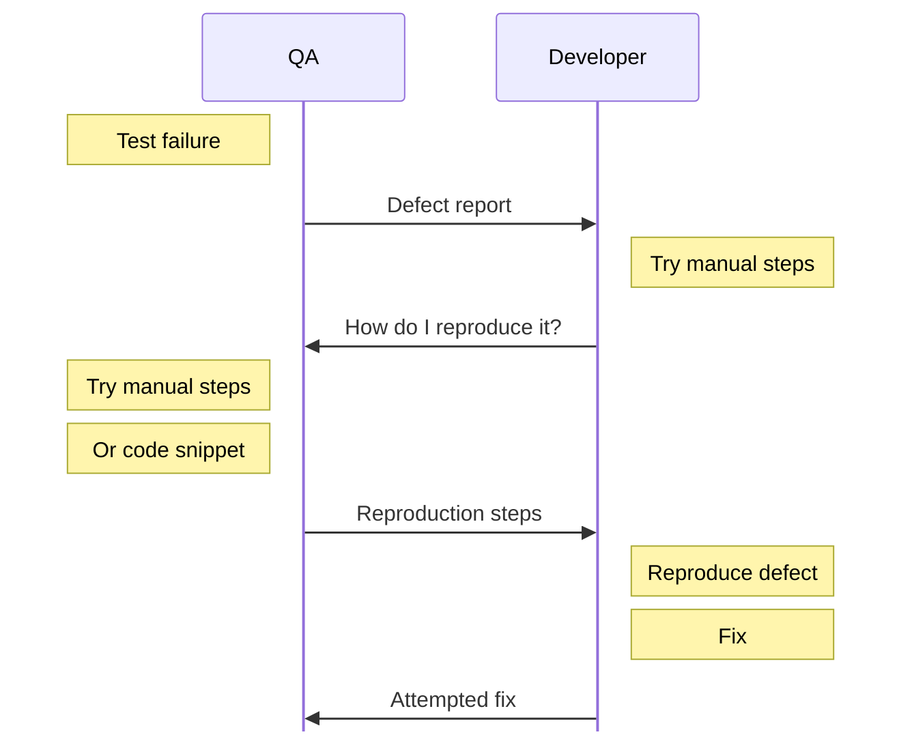
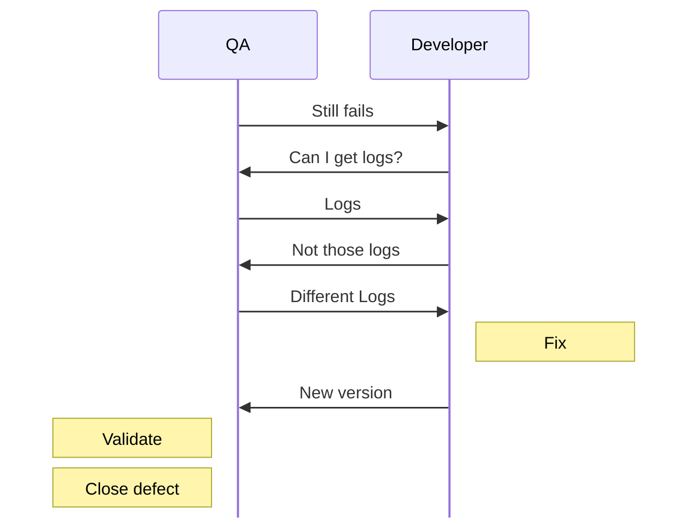
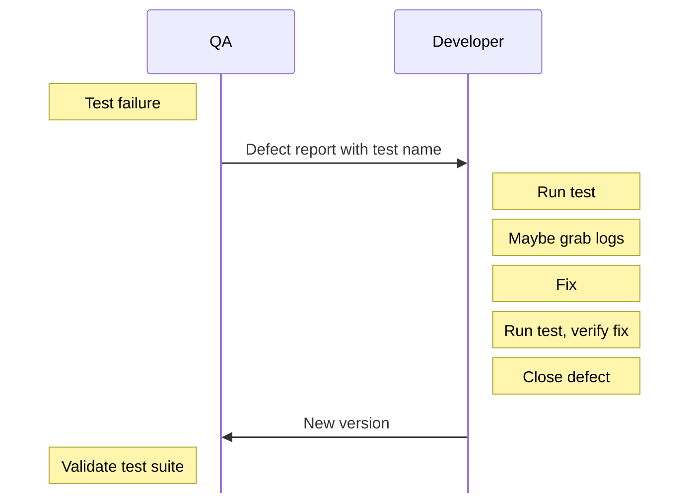

build-lists: true
footer: Brian Okken | pythontest.com/tdd-pybay-2026
list: bullet-character(-)
header: alignment(left)

# Is TDD Still Relevant?

[.text: alignment(center)]
[.header: alignment(left)]

--- 

# Is TDD Still Relevant?
## Yes, but don't be dumb about it.

[.text: alignment(center)]
[.header: alignment(left)]

--- 

# Slides

[.text: alignment(center)]

## pythontest.com/tdd-pybay-2026 
[.hide-footer]

---

# About Me

---
# Podcasts
[.build-lists: false]

[.column]
* Test and Code, 2015 - 2025
* Python Bytes, 2016 - 2026
* Python People, 2023 - 2024 

[.column]
 
 
 

---
# Podcasts
[.build-lists: false]

[.column]
* Test and Code, 2015 - 2025
  * 10 years 
  * 238 epiosdes
* Python Bytes, 2016 - 2026
* Python People, 2023 - 2024

[.column]
 
 
 

---
# Podcasts
[.build-lists: false]

[.column]
* Test and Code, 2015 - 2025
* Python Bytes, 2016 - 2026
  * almost 10 years
  * 482 episodes when I left
  * almost 500 now
* Python People, 2023 - 2024 

[.column]
 
 
 

---
# Podcasts
[.build-lists: false]

[.column]
* Test and Code, 2015 - 2025
* Python Bytes, 2016 - 2026
* Python People, 2023 - 2024 
  * < 1 year
  * 14 episodes

[.column]
 
 
 

---

# Podcasts
[.build-lists: false]

[.column]
* Test and Code, 2015 - 2025
* Python Bytes, 2016 - 2026
* Python People, 2023 - 2024 
* Python People, 2026 - 

[.column]
 
 
 

---

# Python People will Return
 

## https://pythonpeople.pythontest.com

---

# Python People will Return

 

## 14 Previous Guests

[.column]

Michael Kennedy
Paul Everitt
Brett Cannon
Barry Warsaw
Bob Belderbos

[.column]
Naomi Ceder
Mariatta Wijaya
Carlton Gibson
Will Vincent
Julian Sequeira

[.column]
Pamela Fox
Nikita Karamov
Rob Ludwick
Shauna Gordon-McKeon

---

# Python People will Return

 

## Future Guests

* I've got a list
* Let me know if you wanna be on it
* Format might change
* Logo might change
* The people will always be awesome

---

# Courses

^Most people by the bundle

---

# Courses

  

^But it's in 3 parts and they are available separately.
Hundreds of people have signed up for the course.

---

# Books
[.build-lists: false]

  

^It's based on this middle book, the 2nd edition of Python Testing with pytest. 
And now Lean TDD

---

# The topic of this talk
[.build-lists: false]

  

---

# But let's back up

---

# Day Job - Lead Software Engineer
[.build-lists: false]
[.list: bullet-character(-)]

[.column]
* Started at HP, then Agilent
* Now at Rohde & Schwarz 
* Wireless Communication
* Measurements & Signaling
* Embedded Code : C++ 
* Testing : Python + pytest

[.column]
 
 

---

# I promise this is relevant

---

# Satellite & Component Test Systems
[.list: bullet-character(-)]

[.column]
 

[.column]
* Hewlett-Packard (pre-split)
* Instrument drivers, GUI coding, wherever I'm needed
* Few infrequent releases
* Dev team manual testing
* I don't like manual testing

^this is an R&S rack. I was working at HP at the time, but I don't have any pics of those.
^Manual testing sucks, but having the development team test throughout the development cycle, then on system, is very efficient. Lots of bugs don't even get filed, they just get fixed. A problem with manual testing, though, is keeping them fixed.

---

# Spectrum Analyzer 
[.list: bullet-character(-)]

[.column]

* Some cool automation
* Separate QA, but close by
* Simple issue assignments
* All layers from GUI and remote down to DSP
* Seeds of Bones-out development

^Lots of automation
Tests were mostly ready as software was ready

[.column]

^Next a specan
It's great to fix a sucky API before it hits a customer. This job is where "bones-out" first clicked for me as a way to let testing keep pace with development.

---

# Communication Test Box

[.column]

[.column]

* A cell tower in a box
* Complex product, complex architecture
* Separate QA
* Split between 
  * acceptance tests (QA)
  * developer tests (DEV)

^Signal generator + full protocol stack + spectrum analyzer + receive stack
Essentially: acts as a cell tower and full backend to test wireless devices
Super fun. Super complex. Lots of people, teams, hardware, code.

----

# My role: hardware isolation

[.column]

* GUI + Remote
* Protocol Stack 
* Hardware Isolation <- me
* FPGAs, ASICs, etc.
* It was fun
* For the first couple of years

[.column]

^This was fun as I was getting the hang of it, but then got boring.

---

# Burnout driven learning

[.build-lists: false]
[.column]

* Pragmatic Programmer
* Lean Software Development
* Articles on XP & TDD
* TDD by Example
* Even a little Six Sigma

[.column]
 

^So I started reading. I figured, if I'm frustrated with my job, I should make it a better job. So I did.

---
[.build-lists: true]

# Make it better

* Revamped the build chain
* Sped up library swapping
* Wrote command line utilities to speed up development
* Started developer focused testing
* Implemented a smoke test suite
* Tried to apply TDD to an embedded environment

---

# Unit tests 

## are really

# "functionality unit" tests 

* But it worked pretty good
* Except for the wall 

---

# The Wall

---

[.column]
## Development
* "unit" tests
* or smoke tests
* mostly happy path 
* run by devs
* not run regularly

[.column]
## QA
* Acceptance tests
* Run by QA
* Run weekly (I think)
* I still like the ALAC idea

---

# This creates a ton of waste

---

# Defect Ping-Pong

---

[.hide-footer]

^Those reproduction steps are an approximation of what the test is doing. So fix is "maybe a fix".

---

[.hide-footer]

---

# What it should be

---

[.hide-footer]

---

# We weren't there yet

---

# But the ideas were brewing

---

# Oscilloscopes

[.column]

* A more column-ish role
* Below UI, above hardware
* Dev team did testing
* All teams did testing
* Mostly manual
* Yuk

[.column]

---

# Oscilloscopes

[.column]

* Also, communication was broken
* I introduced 
  * wikis
  * lightweight work tracking
  * automated feature tests

[.column]

---

# Test Automation

[.column]

* More devs started writing tests
* Quality up, dev cycle faster
* Managers started noticing - good
* Graphs were misinterpreted - bad

[.column]

---

# Not full success, but I could taste it
## And I wanted more

---

# Back to Comms Testing, at R&S

[.column]
 
 

[.column]
* Test runner was meh
* So I wrote a new one 
* With tests developed by
  * developers 
  * embedded test engineers

---

# Back to Comms Testing, at R&S

[.column]
 
 

[.column]
* Migrated to pytest
* Shifted testing left 
* Quality went up
* Dev cycle faster
* You can see a pattern now
* I hope

----

# Shift left

## Confusion is quick to remedy when domain experts are still working on the problem.

----

# Shift left

## Most problems don't make it to a wide audience

----

# More experiments

[.column]
 
 

[.column]
* ATDD: Acceptance Driven Development
* A version close to Lean TDD
* Using Lean to fight complexity and waste on many fronts

---

# So, TDD

---

# TDD Crash course

---

# TDD started as Test First
## from Extreme Programming (XP)

* XP is also from Kent (and others)
* XP had a footnote that independent testing is still needed.
* I don't think TDD specifically talks about that.

---

# TDD

* Original Recipe TDD
* Classic TDD 
* Classical TDD 
* but not TDD Classic
* Too much like ~~Coke Classic~~
* We'll just call it TDD

---

# TDD Steps

[.column]

1. Quickly add a test.
2. Run all tests and see the new one fail.
3. Make a little change.
4. Run all the tests and see them all succeed.
5. Refactor to remove duplication.

[.column]

^From "Test Driven Development by Example"

[.hide-footer]

---

# Shorter Version

[.column]
1. Red 
2. Green
3. Refactor

[.column]

[.hide-footer]
---
# Shorter Version
[.build-lists: false]

1. Red - write a failing test
2. Green
3. Refactor

^This is the shorthand everyone remembers. It's from the book's preface, repeated throughout, so it's no surprise it's what stuck. But it's incomplete.
Both versions leave a lot of open qustions

[.hide-footer]

---
# Shorter Version
[.build-lists: false]

1. Red - write a failing test
2. Green - write the simplest code to make the test pass
3. Refactor

[.hide-footer]

---

# Shorter Version
[.build-lists: false]

1. Red - write a failing test
2. Green - write the simplest code to make the test pass
3. Refactor - clean it up

^This is the shorthand everyone remembers. It's from the book's preface, repeated throughout, so it's no surprise it's what stuck. But it's incomplete.
Both versions leave a lot of open qustions

[.hide-footer]

---

# Questions

[.build-lists: false]

* What level to I test at? 
* What does "simplest code" mean?
* How do I know what test to write next?
* When am I actually done?

^Because these questions went unanswered, a lot of coaches and trainers stepped in with their own answers - and that's where it got weird (foreshadow "alternative approaches" section).

---

# The list is missing from the summary

## The book had running list of test cases

* It's not in the summary
* It's usually missing from tutorials
* Kent used it to keep track of what work is left
* It comes back as part of Canon TDD

---

# Canon TDD

* 21 years later
* Blog post from Kent in 2023

^Kent Beck wrote "Canon TDD" to clarify what he actually meant. I asked if I could quote it verbatim - he said summarize it in my own words instead, so here's my summary.

---

[.hide-footer]

# Canon TDD Steps

1. Write a list of test cases you think you need.
2. Pick one, write a test function for it.
3. Write/modify code until the whole suite, including the new test, passes.
4. Optionally refactor.
5. Add any newly-discovered test cases to the list.
6. Repeat from step 2 until the list is empty.

---

[.hide-footer]

# Canon TDD Steps

[.build-lists: false]

1. Write **a list of test cases** you think you need.
2. Pick one, write a test function for it.
3. Write/modify code until the whole suite, including the new test, passes.
4. **Optionally refactor.**
5. Add any newly-discovered test cases to the list.
6. Repeat from step 2 until the list is empty.

^Less catchy than Red/Green/Refactor, but it matches the book's actual workflow. The list is explicit. Refactor is explicitly optional - you don't have to write bad code on purpose. And notice: no "simplest code possible" language anymore.

---
[.build-lists: false]

# Interesting omissions

* The word "unit"
* The word "simple" 
* It's possible I am misreading this
* But it seems to imply this should work from system tests down to units.

---

## However
### a lot of wacky stuff happened
## in that 21 years

---
[.build-lists: false]

# Where TDD Went Sideways

* A lot of people were teaching variations
* And filling in the blanks with their own ideas

---

# Where TDD Went Sideways

* Separating acceptance tests from developer tests
* Testing functions over APIs
* Excessive mocking
* "It's not about testing"

^Test is literally in the name. It's the first word!

---
[.build-lists: false]

## Separating acceptance tests from developer tests

* This separates QA and Dev
* Creates the ping-pong
* Creates massive waste

---

## Testing functions over APIs

* This is where the real chaos starts
* Refactoring changes implementation
  * But leaves behavior unchanged
* So focus tests on behavior
  * Not implementation
* Functions are implementation

---

# Alternative TDD flavors

* London / Mockist TDD
* BDD (Behavior Driven Development)
* ATDD (Acceptance Test Driven Development)
* Lean TDD

---

# London / Mockist TDD

* Acceptance tests. Yay!
* Tons of mocks. Boo!
* Outside-in. Kinda cool
* Tied too closely to implementation

^Credit where due: London style is what pulled acceptance tests into the TDD conversation in the first place. That idea survives into BDD, ATDD, and Lean TDD.

---

# BDD: Behavior Driven Development

* Behaviors: Yay!
* Gherkin: Boo!
* Given/When/Then: Yay!
  * It's a mental shift of how to think about
  * Arrange/Act/Assert

^BDD-the-mindset (Dan North) is great: name tests after behavior, think in Given/When/Then. BDD-with-Gherkin turns acceptance criteria into code and requires an interpreter layer - extra process, extra handoffs, less learning. Keep the mindset, skip the pickles.

---

# ATDD: Acceptance Test Driven Development

* A team workflow. Yay!
* Great at describing team collaboration for acceptance criteria
* Acceptance criteria -> acceptance tests
* Kinda leaves the lower level test an exercise for the reader

^This is very close to Lean TDD at the top level. The gap it leaves - what do you do below the acceptance test layer - is exactly what Lean TDD fills in.

---

# Lean TDD

---

# Lean TDD

* All projects, small to huge
* All levels of testing
* Dev and QA
* Is "Unified Field Theory for testing" too grandiose? 

---

# Lean TDD

## Inspired by 

* Canon TDD
* BDD and ATDD
* Lean Software Development
* Experience working on large multi-team projects
* Solo projects

---

# Lean TDD
## All the good stuff, very little waste

---

# Lean TDD
## ~~Tastes great. Less filling.~~ (already taken)

---

# Lean TDD: Handy wavy version

* ATDD at the top
* Subsystem/unit testing only as needed
* One test suite if at all possible
* Room for developers *and* test engineers
* Don't be wasteful. Ceremony as necessary.
* The testing trophy - that rocks

^This is the payoff of the whole "alternative approaches" tour - it's what I landed on after living through all the others.

---

# Test at the Highest Level Reasonable

* Minimizes rework when refactoring
* Encourages refactoring 
* Allows a second draft, etc

----

# Stop shipping your first draft!

- Terrible practice for blog posts and homework
- Never done for books
  - At least, I wouldn't do it
- So why do it with software?

^This is the "so what" - refactoring-friendly tests are what let you actually revise your work.

---

# The Misinterpreted Test Pyramid

< TODO: put a pic here >

---

# The Actual Test Pyramid

< TODO: put a pic here >

---

# The Testing Trophy - OG

< TODO: put a pic here >

---

# The Testing Trophy - My Version

< TODO: put a pic here >

---

# Don't play defect ping-pong

---

# Let Everyone Run Every Test

* Minimize overlap of testing across levels
* Run tests locally if at all possible

^Story: shared pool of hardware instruments. Reserve one matching a bug report, run the failing test locally, debug, grab logs. Compare to the old back-and-forth: "how did you set it up?", "how do I run this?", "try it again on x.y.z", "turn on logging BLAH and rerun" - that's pure waste. Let the developer run the test and poke at it themselves.

---

# Does this work with AI?

---

# Coding and Testing with AI

* Care what the system does -> write/review tests at that level
* Care about your part of the system -> write/review tests there too
* Willing to not review some AI-written code?
  - Then decide if you need to review *its tests*
  - Only safe if you trust the tests above it
* Fixed, "do not modify" tests at higher levels = freedom below
  - For AI, agents, subcontractors, interns, whoever

^The guardrail framing: high level tests you trust let lower layers be a black box you don't have to personally review.

---

# Have Agents Use TDD

* Give agents a spec + a specific test suite to run
* Huge win: I'm not manually re-testing after every change
  - Same experience as QA <-> dev, except now I'm QA
* If an agent writes the high-level tests too:
  - I still review them against my own understanding
  - Agent keeps re-running them while it debugs/fixes

^Equivalent to letting developers run tests QA already built - except the "QA" here can be me directing an agent.

---

# Let's talk Lean

---

# Value & Waste

* Lean: waste = anything that doesn't *directly* add value to the customer
* We can't eliminate all waste
* Tests are waste, in the strict Lean sense
  - (yes, throw your tomatoes)
* So: minimize tests, maximize value

^Let that land for a second before moving to the trophy - it's meant to be a little provocative.

---

# The Test Pyramid
## Mike Cohn, 2009

<!-- picture: resources/pyramid-original.jpeg (Lean TDD book) - "UI / Service / Unit" -->

* Top: UI tests
* Middle: Service tests
* Base: Unit tests

^Point was actually "do more service/API tests, UI testing is painful, don't do much of it." Most people heard "do mostly unit tests" instead.

---

# The Misunderstood Pyramid

<!-- picture: resources/pyramid-common.jpeg (Lean TDD book) - "E2E / Integration / Unit" -->

* Top: E2E tests -> "avoid these"
* Middle: Integration tests -> "someone else's problem"
* Base: Unit tests -> "do mostly this"

^This version is the one that did the damage. E2E isn't inherently brittle - APIs shouldn't be brittle at all. If your API-level tests are brittle, your product is brittle, not your tests.

---

# Flip It

<!-- picture: resources/pyramid-flipped.jpeg (Lean TDD book) -->

* Large top: System API tests
* Middle: Subsystem / component tests
* Small point at bottom: unit tests

^"Ice cream cone anti-pattern" objection = mostly manual regression testing with almost no automation at all. Not the same thing as deliberately choosing to test through stable APIs.

---

# The Testing Trophy
## Kent C. Dodds

<!-- picture: resources/trophy-original.jpeg (Lean TDD book) -->

* Top (small): E2E / UI tests
* Bulk: Integration tests (~system-level, no UI)
* Narrow stem: Unit tests
* Base: Static analysis

^"Write tests. Not too many. Mostly integration." - riff on Michael Pollan's "Eat food. Not too much. Mostly plants." First shape that actually convinced people the pyramid was wrong.

---

# My Recommendation

<!-- picture: resources/trophy-preferred.jpeg (Lean TDD book) -->

* Static analysis - don't skip linting
* A few focused unit/component tests for gnarly bits
* **Bulk of tests at the highest API that makes sense**
* Some UI tests - to test the UI, not the whole system

^This is the shape I actually use, on personal projects, open source, and at work.

---

# Shifting to Higher Level Tests

* "Unified Field Theory" because it treats the whole test stack as one thing
* No redundant tests across levels
* Test at the highest level possible
  - Maximizes zero-test-rework refactoring potential

^Tie back to the earlier "function-level tests wreck refactors" slide - this is the fix.

---

# Which Test Would You Rather See Fail?

* Test A: a unit test some dev thought was important once
* Test B: a system test tied directly to a customer requirement

^Ask the room. If your system-level acceptance tests are thorough, a passing system suite plus one failing unit test is a much better place to be than the reverse. I still investigate unit test failures - I've even written my own tests stricter than the real requirement. But requirement-tied system tests are the ones I trust most.

---

# Applying Lean TDD with Agents

* Keep everything in source control
* Instruct agents: don't delete tests, don't loosen assertions to force green
* Instruct agents: ask before modifying existing test code
* Always review test diffs before merging
* Review every new test, especially ones tied to acceptance criteria

^Real failure modes I've seen: tests that don't actually check the outcome, agents quietly weakening assertions, tests deleted so the suite passes. Treat agent-written code like an open source contribution - grateful for the help, but you're the one maintaining it.

---

# RTFM

* The book is ~100 pages
* Audio book is short too (works great at 1.2-1.5x)
* [leantdd.com](https://leantdd.com)

^Plug Python People rebooting too if there's time.

---
[.build-lists: false]
[.autoscale: true]

# Thank You

[.column]
* [leantdd.com](https://leantdd.com)
  Lean TDD book
  paperback, digital, and audio versions
* [pythontest.com](https://pythontest.com)
  training, courses, books, blog
* [@brianokken@fosstodon.org](https://fosstodon.org/@brianokken)
  Mastodon 
* [@brianokken@fosstodon.org](https://fosstodon.org/@brianokken)
  Bluesky
  

[.column]
