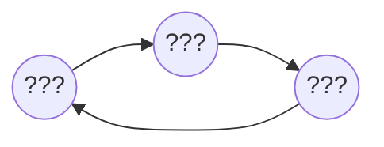
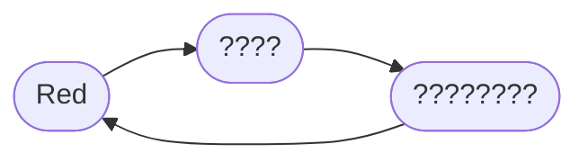

build-lists: true
footer: Brian Okken | pythontest.com/tdd-pybay-2026 

# Is TDD Still Relevant?
## Yes, but don't be dumb about it.

[.text: alignment(center)]

#### _
### Brian Okken

[.hide-footer]

---

# Slides

[.text: alignment(center)]

## pythontest.com/tdd-pybay-2026 
[.hide-footer]

---

# Brian Okken - Podcasts
[.build-lists: false]

[.column]

* Test and Code (2015 - 2025)
* Python Bytes (2016 - 2026)
* Python People (2023 - 2024)

[.column]
 
 

---

# Python People will Return
 

[.text: alignment(center)]
[.hide-footer]
[pythonpeople.pythontest.com](https://pythonpeople.pythontest.com)

### Previous Guests

[.column]

Michael Kennedy
Paul Everitt
Brett Cannon
Barry Warsaw
Bob Belderbos

[.column]
Naomi Ceder
Mariatta Wijaya
Carlton Gibson
Will Vincent
Julian Sequeira

[.column]
Pamela Fox
Nikita Karamov
Rob Ludwick
Shauna Gordon-McKeon

---

# Brian Okken - Books
[.build-lists: false]

[.column]
* Python Testing with pytest
* Lean TDD

[.column]
 

---

# Brian Okken - Courses
[.build-lists: false]

[.column]
[courses.pythontest.com](https://courses.pythontest.com)

[.column]

---

# Brian Okken - Lead Software Engineer
[.build-lists: false]

[.column]
* Currently at Rohde & Schwarz 
* Wireless Communication
* Measurements
* Embedded Code :  C++ 
* Testing : Python + pytest

[.column]
 
 

---

# TDD
## Is TDD Still Relevant?

---

# TDD
## Is TDD Still Relevant?
## Yes, but don't be dumb about it.

^Some presenter notes

---

# TDD

---

# TDD

---

# TDD

---
---
---
---
---

---
[.build-lists: false]
[.autoscale: true]

# Contact

[.column]
* [leantdd.com](https://leantdd.com)
  Lean TDD book
  paperback, digital, and audio versions
* [pythontest.com](https://pythontest.com)
  training, courses, book
* [@brianokken@fosstodon.org](https://fosstodon.org/@brianokken)
  Mastodon 
* [@brianokken@fosstodon.org](https://fosstodon.org/@brianokken)
  Bluesky
  

[.column]
  
