build-lists: false
footer: Brian Okken | pythontest.com/tdd-pybay-2026
header: alignment(left)
list: bullet-indent(10)
slidenumbers: true
<!-- list: bullet-character(•) -->

# Is TDD Still Relevant?
## Yes, but don't be dumb about it.

^80 slides. 2 per minute

---

# Brian Okken

* Lead Software Engineer at Rohde & Schwarz
* Wireless Communications
* Mostly measurements
* C++ : Mostly embedded code 
* Python : Testing and automation
* pytest : of course

---

# Brian Okken

But you may know me from 

* podcasts
* books
* or maybe a pytest course

---
# Podcasts
[.build-lists: false]

[.column]
* Test and Code, 2015 - 2025
* Python Bytes, 2016 - 2026
* Python People, 2023 - 2024 

[.column]
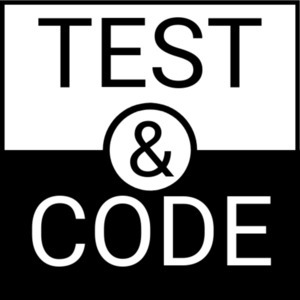 
 
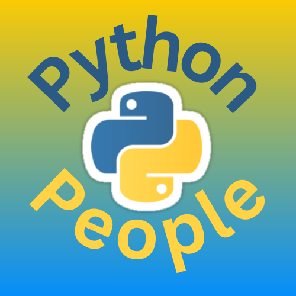 

---
# Podcasts
[.build-lists: false]

[.column]
* Test and Code, 2015 - 2025
  * 10 years 
  * 238 epiosdes
* Python Bytes, 2016 - 2026
* Python People, 2023 - 2024

[.column]
 
 
 

---
# Podcasts
[.build-lists: false]

[.column]
* Test and Code, 2015 - 2025
* Python Bytes, 2016 - 2026
  * almost 10 years
  * 482 episodes when I left
  * almost 500 now
* Python People, 2023 - 2024 

[.column]
 
 
 

---
# Podcasts
[.build-lists: false]

[.column]
* Test and Code, 2015 - 2025
* Python Bytes, 2016 - 2026
* Python People, 2023 - 2024 
  * < 1 year
  * 14 episodes

[.column]
 
 
 

---

# Python People will Return
 

## https://pythonpeople.pythontest.com

---

# 14 Amazing Previous Guests

 

[.column]

Michael Kennedy
Paul Everitt
Brett Cannon
Barry Warsaw
Bob Belderbos

[.column]
Naomi Ceder
Mariatta Wijaya
Carlton Gibson
Will Vincent
Julian Sequeira

[.column]
Pamela Fox
Nikita Karamov
Rob Ludwick
Shauna Gordon-McKeon

---

[.build-lists: false]

# Future Guests

 

* I've got a list started
* Let me know if you wanna be on it
* Format might change
* Logo might change
* The people will always be awesome

---

# Books
[.build-lists: false]

  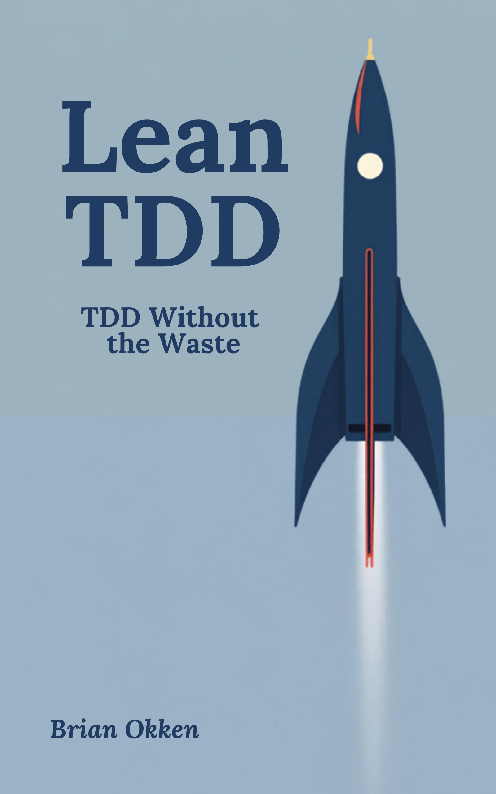

---

# Courses

^That 2nd edition of the pytest book is also a course bundle. 

---

# Courses

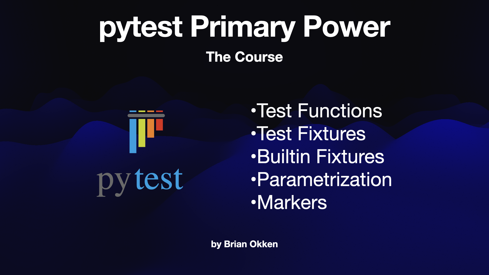 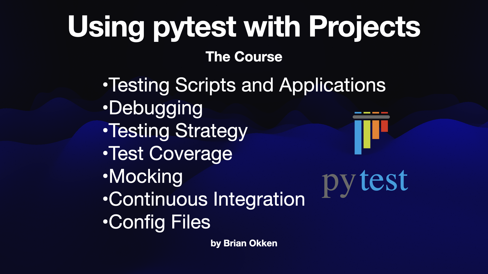 
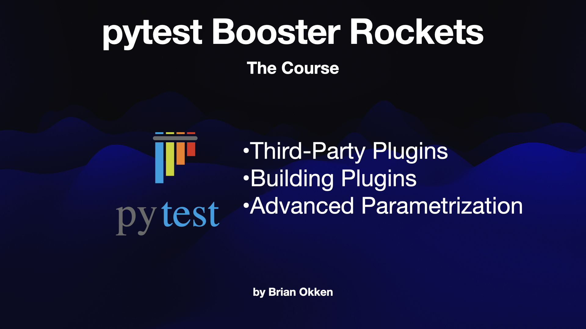

^It's in 3 parts, and those are available individually

---

# Lead Software Engineer
[.build-lists: false]

---

# TDD

^Today we're talking about TDD
Show of hands
Raise your hand if
* you've ever tried TDD?
* currently use TDD?
* has an opinion about TDD?

^Yeah. Me too. Strong ones, that I've developed over the course of my career.

---

# My career
## A CS nerd in an EE world

---

# My career
## Building software (and hardware), with tests

---

[.build-lists: false]

# Satellite Test Systems

[.column]
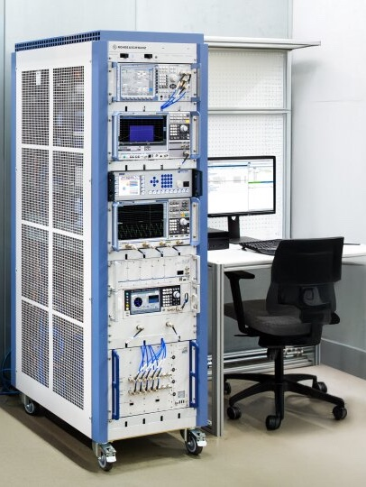 

[.column]
* Started at Hewlett-Packard
* Instrument drivers, GUIs, utilities, ...
* Dev team testing: Yay!
* Manual testing: Boo!

---

# Spectrum Analyzer - Cellular Measurements

[.column]

* Cell Tower Testing
* Measurements from UI to DSP
* Tests done by a QA team
* QA not embedded, but close

[.column]

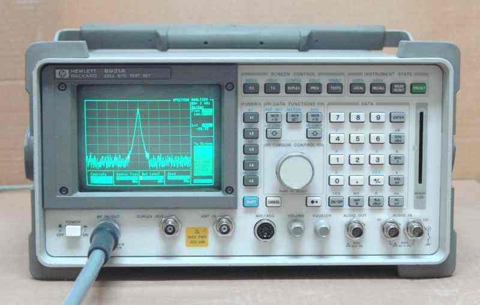

---

# Wireless Communication Tester

[.column]

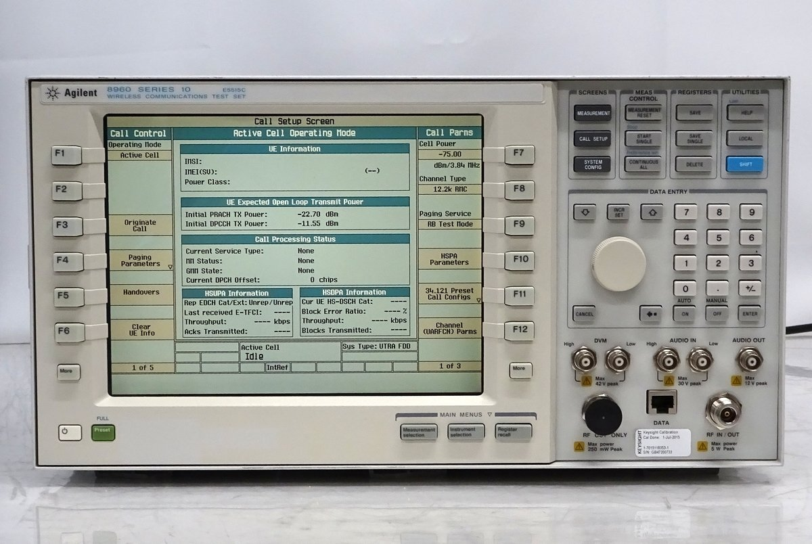

[.column]

* A cell tower in a box
* Hardware isolation
* Separate QA
* Hard to test my code 
* So I looked for ways to improve the processes

----

# Process Learning

[.build-lists: false]
[.column]

* Pragmatic Programmer
* Lean Software Development
* Articles on XP & TDD
* TDD by Example

[.column]
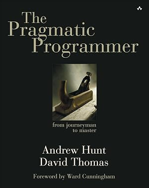 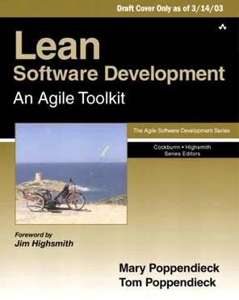
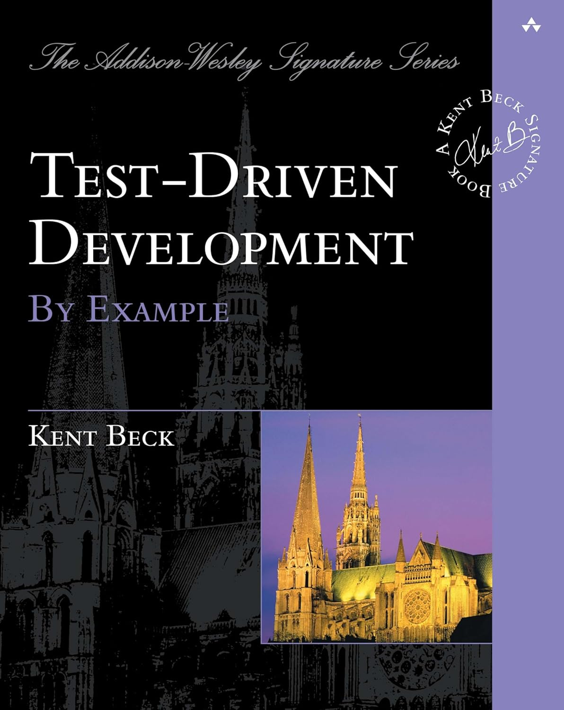

----

# Started trying TDD

----

# TDD with embedded code has challenges

* Compile, load, reboot cycle
* Testing in micro steps is too slow
* Bigger steps was doable
* Needed a debug API to reach my code

----

# Started noticing the weird split between QA and dev regarding testing.

---

# Using the same tools, but not working together

* A common Python test framework
* Testing against the public remote interface

But...

* Can't run each others tests

---

[.build-lists: true]

[.column]
## QA
* Test racks with extra equipment
* Final acceptance tests
* Happy path, error cases, etc.
* ALAC or workflow tests
* run regularly

[.column]
## Developer tests
* Individual boxes, maybe two.
* Tests to convince myself my code works
* Mostly happy path
* a.k.a. CYA tests
* not run regularly

---

## After just reading 
## Lean Software Development
# this wastefulness was frustrating

--- 

# 7 kinds of waste

[.column]
1. Partially done work
2. Extra Processes
3. Extra Features
4. Task Switching

[.use-source-list-numbering]
[.column]
5. Waiting
6. Motion (hand offs)
7. Defects

^Let's see how many you can find in the following scenario

--- 

# Defect Ping-Pong

---

[.hide-footer]

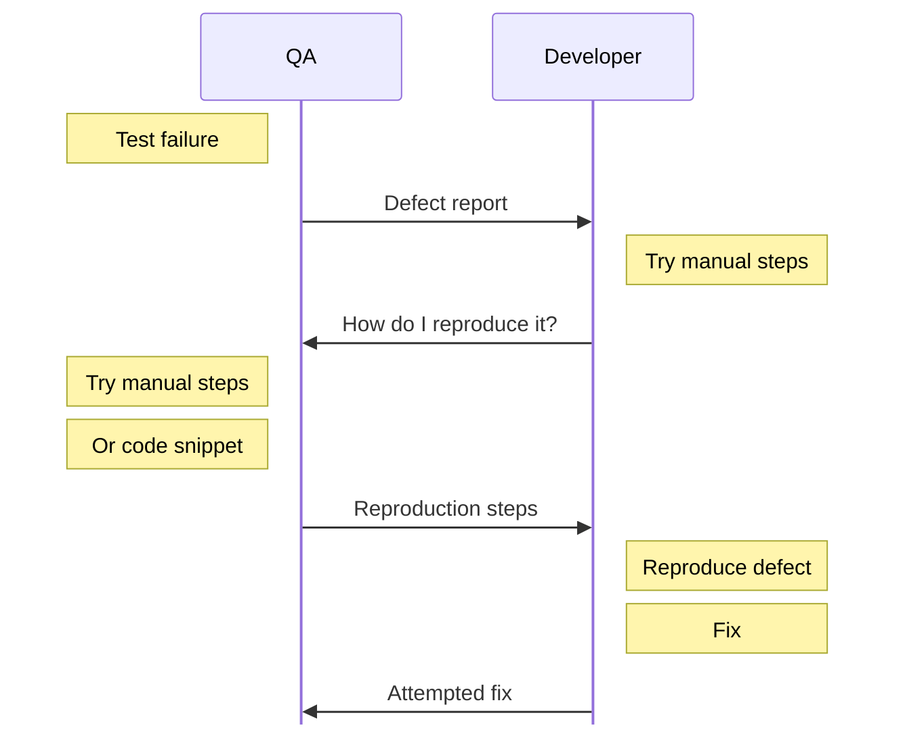

---

[.hide-footer]

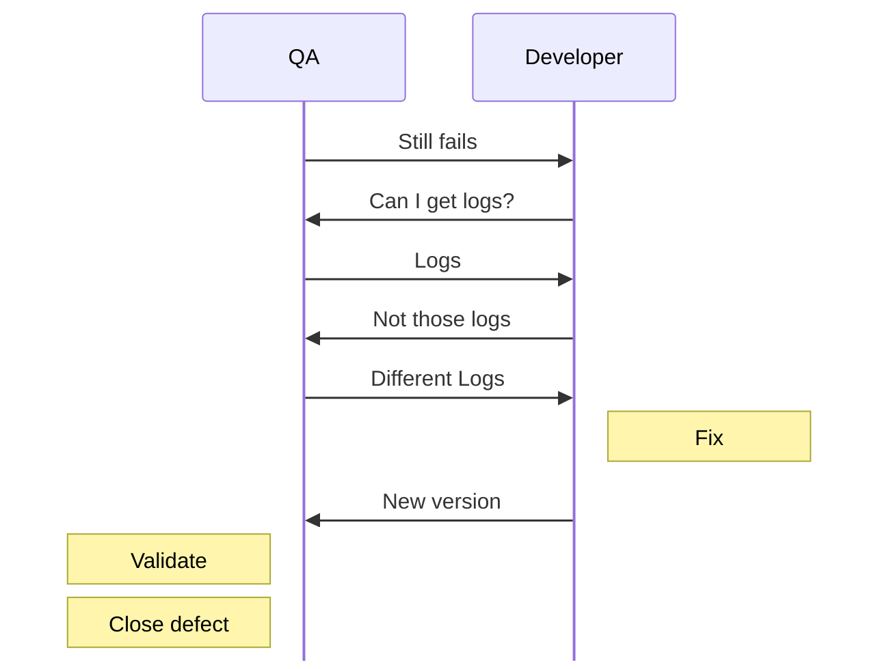

---

# At least of 6 the 7 forms of waste

**1. Partially done work**
**2. Extra Processes**
3. Extra Features
**4. Task Switching**
**5. Waiting**
**6. Motion (hand offs)**
**7. Defects**

---

# What it should be

---

[.hide-footer]

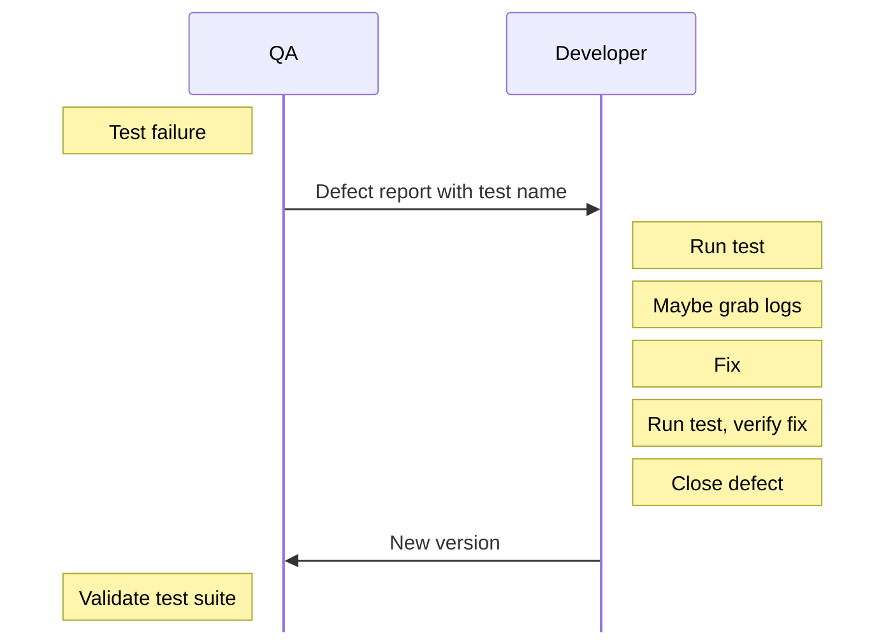

---

# Oscilloscopes

[.column]

* A lot of manual testing
* Way too much
* I started doing test automation
* And teaching colleagues

[.column]

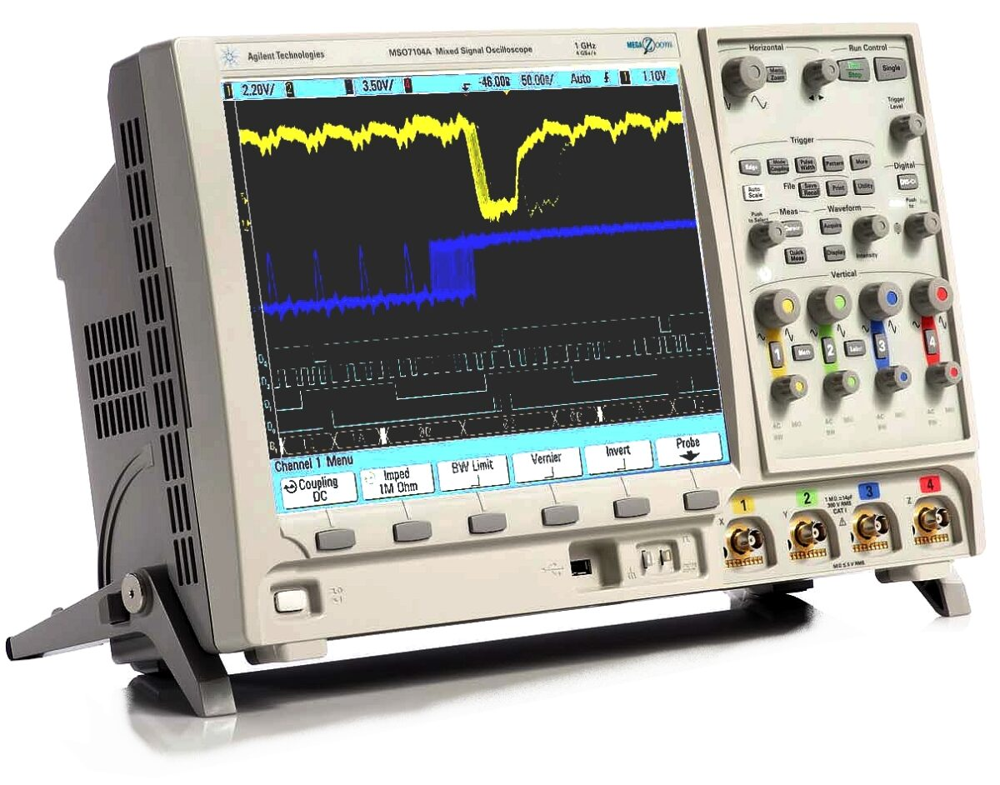

---

# Test Automation

[.column]
* API level tests
* By developers
* Validating features during development
* Development test suite doubles as the acceptance suite

[.column]

---

<!-- # Put your best person in charge

## a story

^A memorable story about that time. The R&D manager pulled me aside and asked what I would do to increase test coverage, and increase the quality of the tests.
* I told him to pull one of the top software engineers in the group and one of the scope domain experts, and have them each spend at least half time focused on the question of "how do we know it's working".
He told me I was insane.
* I still hold that I was right.

--- -->

# Wireless Communication Tester at R&S

[.column]
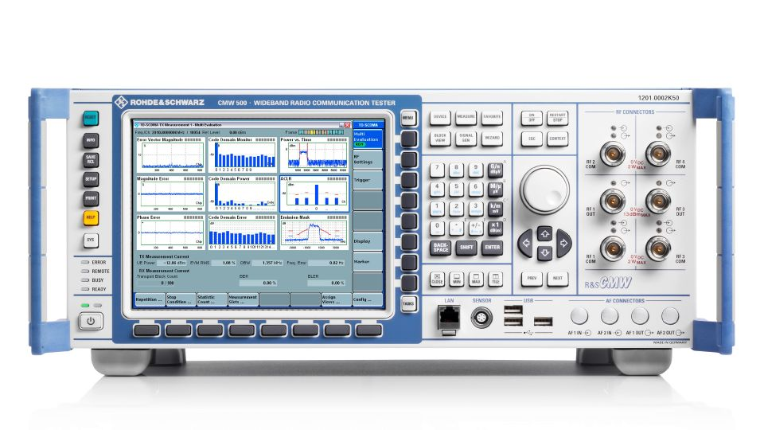 
 

[.column]
* Test runner was meh
* So I wrote a new one 
* Python, of course
* Quickly migrated to pytest

---

# Wireless Communication Tester at R&S

[.column]
* A team lead for about 10 years
* Tests written by developers and test engineers
* All through the API
* Very few quality issues when dev and test together

[.column]
 
 

----

# A benefit from testing early

## Ambiguity is quick to remedy when domain experts are still working on the problem.

----

# Another

## Most problems don't make it to a wide audience

----

## So we should probably get on with it and actually cover ...

---

# TDD : Test Driven Development

---

# TDD: Test Driven Development
[.build-lists: true]

[.column]

* The Kent Beck one
* Classic TDD 
* Classical TDD 
* but not TDD Classic
* Too much like ~~Coke Classic~~

[.column]

---

# TDD Steps
[.build-lists: true]

[.column]

1. Quickly add a test.
2. Run all tests and see the new one fail.
3. Make a little change.
4. Run all the tests and see them all succeed.
5. Refactor to remove duplication.

[.column]

^From "Test Driven Development by Example"

[.hide-footer]

---

# Shorter Version

[.column]
1. Red 
2. Green
3. Refactor

[.column]

[.hide-footer]
---
# Shorter Version
[.build-lists: false]

[.column]
1. Red - write a failing test
2. Green
3. Refactor

^This is the shorthand everyone remembers. It's from the book's preface, repeated throughout, so it's no surprise it's what stuck. But it's incomplete.
Both versions leave a lot of open questions

[.column]

[.hide-footer]

---
# Shorter Version
[.build-lists: false]

[.column]
1. Red - write a failing test
2. Green - write the simplest code to make the test pass
3. Refactor

[.column]

[.hide-footer]

---

# Shorter Version
[.build-lists: false]

[.column]
1. Red - write a failing test
2. Green - write the simplest code to make the test pass
3. Refactor - clean it up

[.column]

^This is the shorthand everyone remembers. It's from the book's preface, repeated throughout, so it's no surprise it's what stuck. But it's incomplete.
Both versions leave a lot of open qustions

[.hide-footer]

---

[.build-lists: false]

[.column]
## Questions
* What does "simplest code" mean?
* How do I know what test to write next?
* When am I actually done?

[.column]
## TDD
1. Red - write a failing test
2. Green - write the simplest code to make the test pass
3. Refactor - clean it up

^Because these questions went unanswered, a lot of coaches and trainers stepped in with their own answers - and that's where it got weird (foreshadow "alternative approaches" section).

---

# Also, there's a missing piece

---

# The list of test cases

* Kent used it in the book 
* Started with a list of things to test
* Added to the list during development
* But most people forget about this list
* It's not in Red/Green/Refactor or even the longer summary

---

[.build-lists: true]
# 21 Years of Chaos

* TDD factions
* Classic vs Mockist
* Statements like
  * "TDD isn't about testing, it's about design"
* BDD, ATDD, Double loop TDD
* Gherkin 

---

# Canon TDD

* 21 years later, in 2023, a blog post from Kent 
* To clarify what he meant by TDD

^Kent Beck wrote "Canon TDD" to clarify what he actually meant. I asked if I could quote it verbatim - he said summarize it in my own words instead, so here's my summary.

---

[.hide-footer]
[.build-lists: false]

# Canon TDD Steps

1. Write a list of test cases you think you need.
2. Pick one, write a test function for it.
3. Write/modify code until the whole suite, including the new test, passes.
4. Optionally refactor.
5. Add any newly-discovered test cases to the list.
6. Repeat from step 2 until the list is empty.

---

[.hide-footer]
[.build-lists: false]

# Canon TDD Steps - the list is back

1. **Write a list of test cases you think you need.**
2. Pick one, write a test function for it.
3. Write/modify code until the whole suite, including the new test, passes.
4. Optionally refactor.
5. **Add any newly-discovered test cases to the list.**
6. Repeat from step 2 until the list is empty.

---

[.hide-footer]
[.build-lists: false]

# Canon TDD Steps - refactoring is optional

1. Write a list of test cases you think you need.
2. Pick one, write a test function for it.
3. Write/modify code until the whole suite, including the new test, passes.
4. **Optionally refactor.**
5. Add any newly-discovered test cases to the list.
6. Repeat from step 2 until the list is empty.

---

[.hide-footer]
[.build-lists: false]

# Canon TDD Steps - no longer simple

1. Write a list of test cases you think you need.
2. Pick one, write a test function for it.
3. Write/modify code until the whole suite, including the new test, passes. **No mention of "simplest code"**
4. Optionally refactor.
5. Add any newly-discovered test cases to the list.
6. Repeat from step 2 until the list is empty.

^Just interesting, is all.

---

## Some good came from the 21 years of chaos 

---

# There are lessons in the alternative forms of TDD

---

# Some of the ideas are worth keeping

---

# London / Mockist TDD
[.build-lists: true]

* Test against the API. Yay!
* Tons of mocks. Boo!
* Tests implementation
* Hard to read

^Credit where due: London style is what pulled acceptance tests into the TDD conversation in the first place. That idea survives into BDD, ATDD, and Lean TDD.

---

# BDD: Behavior Driven Development
[.build-lists: true]

* Behaviors: Yay!
* Given/When/Then: Yay!
* Domain Specific Language DSL: Yay!
* Gherkin: Boo!

^* It's a mental shift of how to think about
* Arrange/Act/Assert

---

# ATDD: Acceptance Test Driven Development
[.build-lists: true]

* Similar to BDD
* A team workflow. Yay!
* Focus on acceptance tests: Yay!

--- 

# Lets take all the good stuff
## Leave out the waste 
## and create ...

---

# Lean TDD

---

# Lean TDD

* Take Canon TDD
* Test against the API - *from London TDD*
* Test behavior, not implementation - *from BDD and Canon TDD*
* Start with acceptance criteria - *from ATDD*
* Scale process up and down as needed - *using Lean*

---

# Lean TDD

## Steps and Strategies

---

[.column]
# Lean TDD Steps 
1. List the acceptance criteria
2. Expand one into test cases
3. Write a test
4. Make it pass
5. Optionally refactor
6. Add to lists as needed
7. Repeat until done

[.column]

[.hide-footer]

---

[.hide-footer]

[.column]
# Lean TDD Steps 

1. **List the acceptance criteria**
2. Expand one into test cases
3. Write a test
4. Make it pass
5. Optionally refactor
6. Add to **lists** as needed
7. Repeat until done

[.column]
# Canon TDD Steps

1. List of test cases
2. Write a test
3. Make it pass
4. Optionally refactor.
5. Add to **list** as needed
6. Repeat until done

---

[.column]
# Lean TDD Steps 
1. List the acceptance criteria
2. Expand one into test cases
3. Write a test
4. Make it pass
5. Optionally refactor
6. Add to lists as needed
7. Repeat until done

[.column]

[.hide-footer]

---

# But I need a reminder to run the whole test suite

---

# Lean TDD Steps - Full list

[.column]
1. List acceptance criteria
2. **Run the test suite**
3. Expand one into test cases
4. Write a test
5. Make it pass
6. **Run the test suite**

[.column]
[.use-source-list-numbering]

7. Optionally refactor
8. Add to lists as needed
9. Repeat until done

[.hide-footer]

---

# Lean TDD Strategies 

* Book also includes 13 strategies

---

# A few strategies

* Test primarily through a system API
* Design for an internal system API if necessary
* Add lower level testing as needed
* Minimize tests tightly coupled to implementation
* Use static analysis
* Use the testing trophy

---

# The Testing Trophy

---

# Testing Trophy 

[.column]
* Kent C Dodds
* "Write tests. Not too many. Mostly integration." 
  * A blog post by Dodds
  * based on a tweet from Guillermo Rauch

[.column]
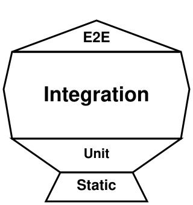

^- riff on Michael Pollan's "Eat food. Not too much. Mostly plants." First shape that actually convinced people the pyramid was wrong.

---

# Testing Trophy - my drawing

[.column]
* My attempt at drawing a trophy
* The labels might make sense for js 
* Don't really match terms I'm used to when talking about testing.

[.column]
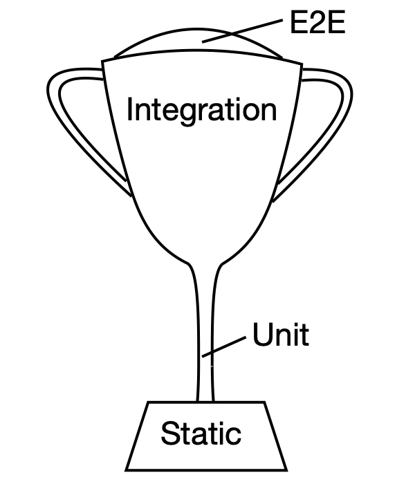

---

# Testing Trophy - my version

[.column]
* Don't do many UI tests
* Mostly test through the API
* As high up as is reasonable
* Not too many unit and or component tests
* Be sure to use static analysis

[.column]
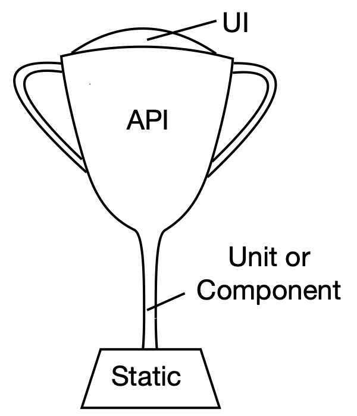

---

# What about AI?

---

# Does this work with AI?

* It's actually a great fit

---

# Coding and Testing with AI

* We care even more about system behavior now
* And less about implementation details
* So higher level tests are more valuable

---

# Way more detail in the book

[.column]

* Landing page: leantdd.com
* Text version is ~100 pages
* Audio book is about 2 hours (or less depending on speed)
* Non-Amazon versions will be start to become available in November

[.column]

---
[.build-lists: false]
[.autoscale: true]

# Thank You

[.column]
* [leantdd.com](https://leantdd.com)
  Lean TDD book
  paperback, digital, and audio versions
* [pythontest.com](https://pythontest.com)
  training, courses, books, blog
* [@brianokken@fosstodon.org](https://fosstodon.org/@brianokken)
  Mastodon 
* [@brianokken@fosstodon.org](https://fosstodon.org/@brianokken)
  Bluesky
  

[.column]
